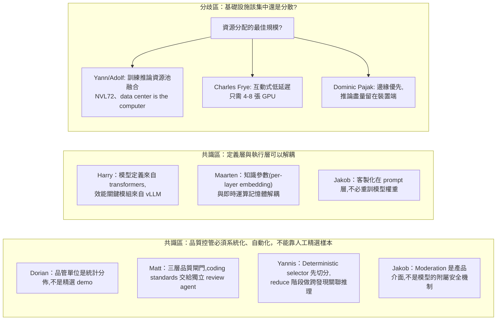
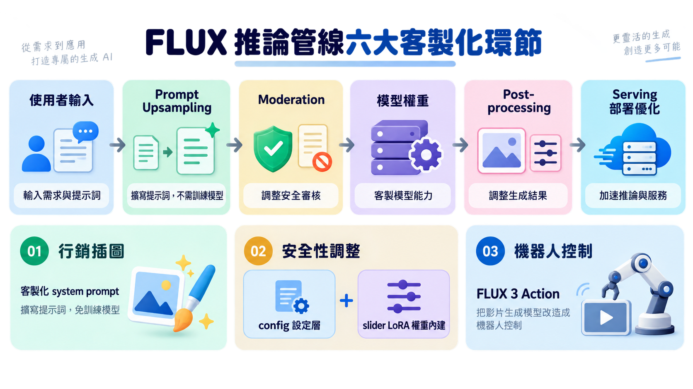
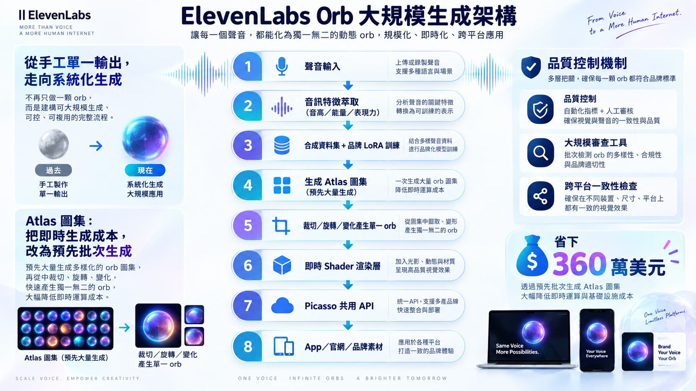
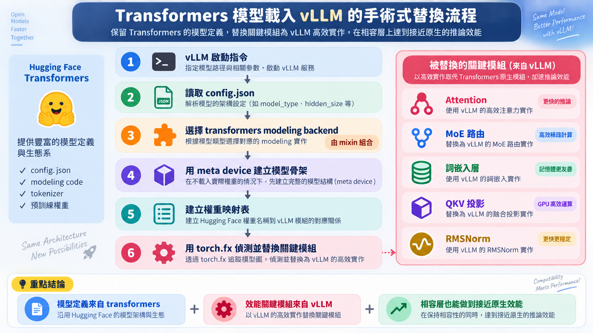
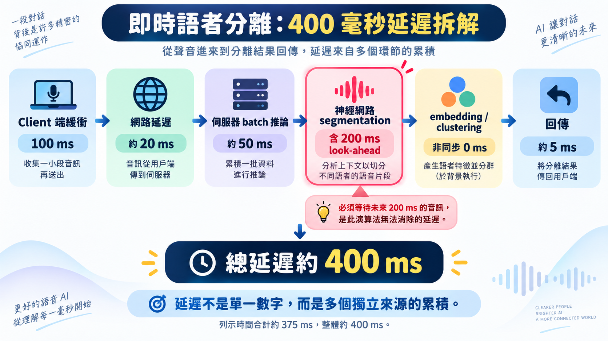
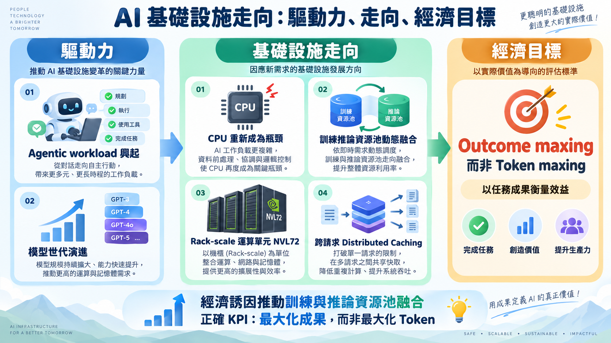
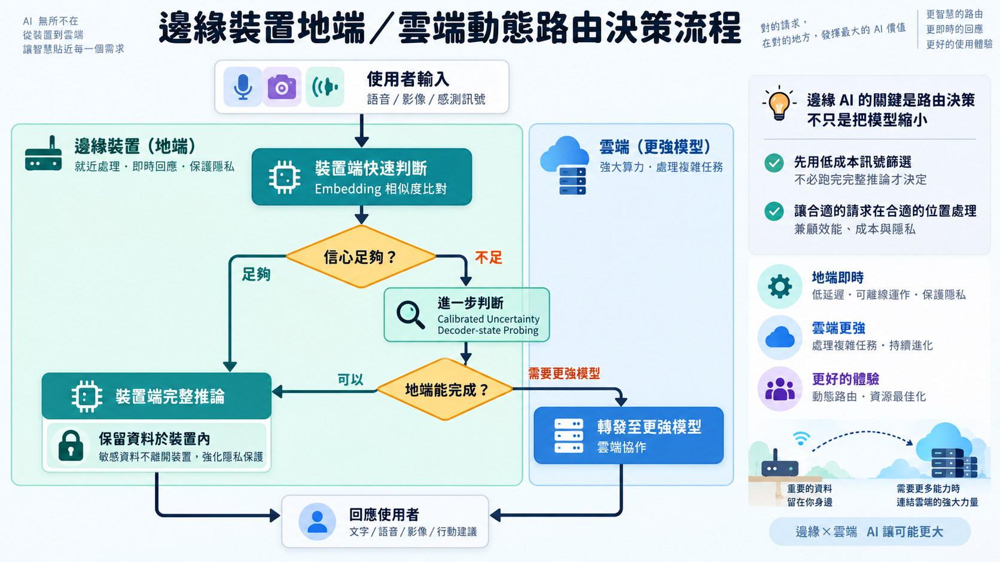
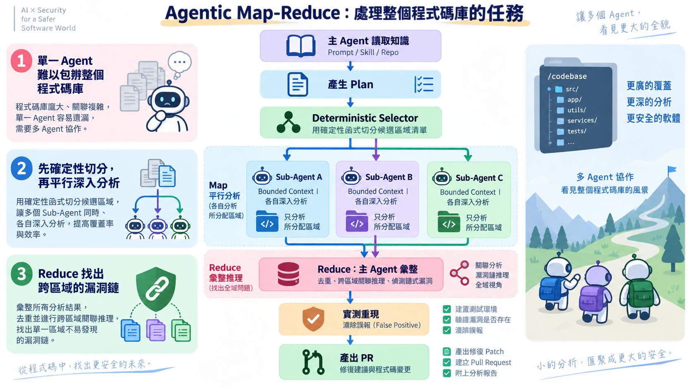
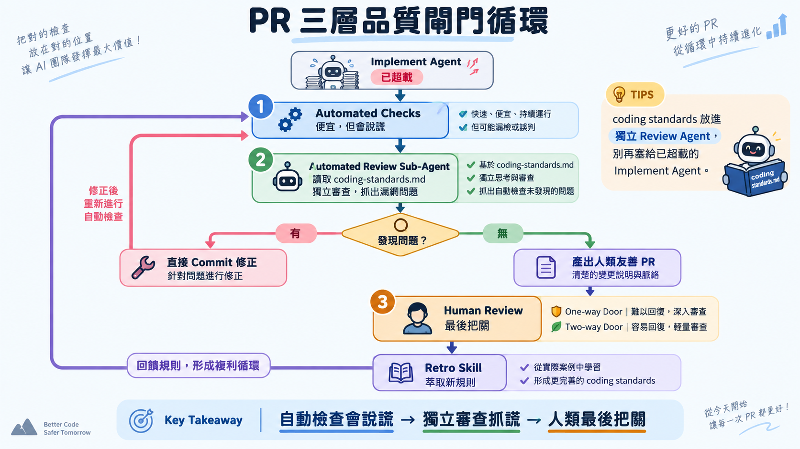
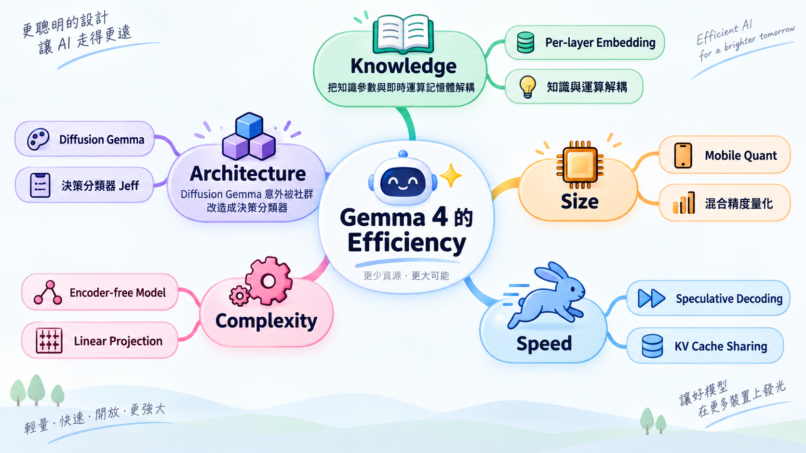

# AI Engineer Paris 2026（Day 2・Main Stage 全日）演講心得報告

## 1. 目錄

- [From Pixels to Robots: How we customize FLUX for production｜從像素到機器人：我們如何為正式環境客製化 FLUX（🟢）](#pixel-robots) — Jakob Pörschmann, Black Forest Labs
- [Generating Identity at Scale, ElevenLabs' AI-Driven Orb｜大規模打造視覺身分：ElevenLabs 的 AI 驅動球體（🟢）](#voice-orb) — Dorian Lods, ElevenLabs
- [How a Transformers Model Loads in vLLM｜Transformers 模型如何載入 vLLM（🟢）](#vllm-transformers) — Harry Mellor, Hugging Face
- [Inside the AI economy: What Stripe's data reveals｜深入 AI 經濟：Stripe 資料揭露了什麼（🟢）](#stripe-ai-economy) — Arielle Le Bail, Stripe
- [From research to production: How we rebuilt a streaming model｜從研究到正式環境：我們如何重建一個串流模型（🟢）](#streaming-voice) — Hervé Bredin, pyannoteAI
- [Building the infrastructure behind the next-generation of AI｜打造支撐下一代 AI 的基礎設施（🟡）](#ai-infra) — Yann Leger（Mistral）× Adolf Hohl（NVIDIA）
- [The low-latency inference engineering playbook｜低延遲推論工程實戰手冊（🟢）](#latency-inference) — Charles Frye, Modal
- [Eyes Up: Edge AI Innovation｜抬頭看：邊緣 AI 創新（🟢）](#edge-ai) — Dominic Pajak, Arm
- [Closing the Distance: Agentic Map-Reduce for Coding｜縮短差距：程式開發的 Agentic Map-Reduce（🟢）](#agentic-map-reduce) — Yannis Psorakis, Cognition
- [Fixing the PR Bottleneck｜解決 PR 瓶頸（🟢）](#pr-bottleneck) — Matt Pocock
- [The Efficiency of Gemma 4｜Gemma 4 的效率設計（🟢）](#gemma4) — Maarten Grootendorst, Google DeepMind
- [The Missing Layers of Conversational AI｜對話式 AI 少了哪幾層（🟢）](#conversational-ai) — Olivier Teboul, Gradium

## 2. 議程理解與整體脈絡

Day 2 Main Stage 一整天 12 場演講，表面上橫跨生成媒體、推論引擎、語音、商業資料、agentic coding 五個不同主題，但貫穿全天的其實是同一條軸線：**當 AI 系統要從「demo 能動」規模化到「真的能撐起一個產品」，瓶頸系統性地從模型能力本身，轉移到「設計產生輸出的系統」與「即時決定資源怎麼分配」這兩件事**。

全天可以拆成四個時段，各自回答同一條軸線的不同切面：

- **上午場／規模化生產**（Jakob、Dorian、Harry、Arielle）：生成媒體從手工單一輸出變成設計系統本身（Dorian 明確點名「這跟程式碼那邊已經發生的事一樣」）；推論引擎從專屬實作變成結構化偵測＋模組置換（Harry）；Stripe 的資料則證明連「誰是買家」都在規模化的壓力下重新定義（Arielle：agent 正超越人類成為文件的主要讀者）。
- **下午場／基礎設施路線之爭**（Hervé、Yann/Adolf、Charles、Dominic）：同一天、同一個 Main Stage，NVIDIA/Mistral 主張訓練推論資源池融合集中（NVL72、"data center is the computer"），Modal 的 Charles Frye 卻現場示範低延遲互動只需要 4-8 張 GPU，Arm 的 Dominic Pajak 更直接把賭注押在裝置端優先。三個講者對「規模」的定義完全不同，但都各自言之成理——優化的目標函數（訓練吞吐量、互動延遲、隱私與成本）本來就不一樣。
- **傍晚場／agentic coding 的規模化**（Yannis、Matt）：同一個「規模化」問題搬進寫程式本身——單一 agent 啃不動 codebase-wide 任務，加速產出的 agent 若沒有配套的品質閘門會變成「slop cannon」。
- **壓軸／模型架構層的回應**（Maarten、Olivier）：怎麼把「知識」與「即時運算資源」解耦，讓效率與能力可以同時存在。

## 3. 跨議程交叉分析

### 3a. 觀點收斂與分歧圖

### 3b. 主題關聯矩陣

| 核心主題 | 相關議程 | 立場摘要 | 交叉洞見 |
|---|---|---|---|
| 品質控管方法論 | Dorian、Matt、Yannis、Jakob | Dorian：大規模統計抽樣審查；Matt：三層閘門＋獨立 review agent；Yannis：selector 切分＋reduce 階段驗證；Jakob：moderation 前置為產品層 | 四個完全不同領域（設計、程式碼、安全掃描、內容安全）都在說同一件事：**人工精選樣本的品管方式在規模化後必然失效，必須換成自動化、可統計驗證的機制** |
| 定義與執行解耦 | Harry、Maarten、Jakob | Harry：模型定義／效能模組解耦；Maarten：知識參數／即時記憶體解耦；Jakob：prompt 層／模型權重解耦 | 這是一個可遷移到系統架構決策的通用思維：**把「設計時該決定的事」與「執行時該優化的事」拆開，各自獨立演進** |
| 基礎設施規模之爭 | Yann/Adolf、Charles、Dominic | 集中訓練推論融合 vs. 小規模高互動性 vs. 邊緣優先 | 三者並非互斥，而是各自對應不同工作負載（大規模訓練/高吞吐 vs. 互動式低延遲 vs. 隱私與成本敏感），提醒讀者角色：**問「該用幾張 GPU」之前，先問清楚要優化的指標是什麼** |
| Agent 作為新主體 | Arielle、Yannis、Matt | Arielle：agent 是新買家；Yannis：agent 作為 map-reduce 的執行單元；Matt：agent 角色需要專責分工（implement vs review） | Agent 正在從「工具」變成需要被獨立設計介面、獨立分工、獨立當作受眾的「系統參與者」 |

### 3c. 整合行動優先序

| 優先序 | 行動建議 | 來源議程 | 預期影響 |
|---|---|---|---|
| 1 | 為任何規模化的 AI 生成/自動化產出流程（內容生成、程式碼、安全掃描）建立**大規模抽樣審查機制**，取代僅靠人工精選案例做展示驗收 | Dorian + Matt + Yannis | 在問題規模化到無法逐一人工檢視之前，先把品管單位從「樣本」換成「統計分佈」，是本場最高頻出現、跨四個領域收斂的共識 |
| 2 | 評估任何「跨框架/跨環境需要支援同一份邏輯」的內部系統，能否採用「定義與執行解耦」的架構思維（結構化偵測＋模組置換），而非為每個環境重寫一份 | Harry + Maarten + Jakob | 降低長期維護成本的通用架構原則，適用範圍不限於 AI 推論引擎 |
| 3 | 釐清組織內部 AI 基礎設施決策的真正優化目標（訓練吞吐量？互動延遲？隱私與成本？），再據此選擇集中式資源池或邊緣優先架構，避免「越大越好」的採購直覺 | Yann/Adolf + Charles + Dominic | 避免把互動式低延遲場景的預算，錯誤地投入到為訓練/高吞吐設計的巨型叢集規格上 |
| 4 | 檢視組織對外文件（API 說明、定價頁面）是否對 agent 可讀，並開始把 agent 視為需要獨立設計的「使用者/買家」而非單純的自動化工具 | Arielle | Stripe 資料顯示 agent 讀取量已超越人類，這是現在進行式而非未來式，文件與介面設計調整得越早，越有機會卡住先行者位置 |

---

## 4. 各議程筆記

## From Pixels to Robots: How we customize FLUX for production｜從像素到機器人：我們如何為正式環境客製化 FLUX
### A. 基本資訊

- 講者：Jakob Pörschmann（Black Forest Labs，AI Solutions 團隊負責人，帶領 Forward Deployed Engineering 與 Solutions Engineering 團隊）
- 時間與地點：Day2（9/24）09:30–10:00，Main Stage
- 關鍵字：prompt upsampling、moderation as product surface、slider LoRA、world action model、FLUX 3 Action
- 品質等級：🟢 高密度

**講者背景**：Jakob Pörschmann 現任 Black Forest Labs（FLUX 影像/影片生成模型開發商，2024 年由前 Stability AI 成員 Robin Rombach、Andreas Blattmann、Patrick Esser 等人於德國 Freiburg 創立）的 AI Solutions 團隊負責人，駐點柏林，帶領 Forward Deployed Engineering 與 Solutions Engineering 團隊。公開資料顯示他長期關注雲端 ML 工程領域，曾以 Towards Data Science 作者身分發表技術文章，並在 Kaggle 等平台展示過 GCP 原生的模組化 Graph RAG 實作，顯示其背景橫跨資料工程與生成式 AI 應用落地。更詳細的過往任職經歷查無公開一手資料，以下內容以演講中的自我介紹與逐字稿脈絡為準。

### B. 核心思想煉金

**思想寶石**：Jakob 把「客製化」拆解成推論管線上的六個介入點，其中最反直覺的兩個洞見是：一、圖片生成模型本身早已不是瓶頸，真正的瓶頸是「如何把設計規範翻譯成模型訓練分布聽得懂的語言」，這件事完全不需要重新訓練模型，只靠客製化 prompt upsampling 的 system prompt 就能解決（🔑 反直覺：多數人以為客製化生成品質要靠微調模型本身；⚡ 行動改變性：組織導入生成式媒體時應先投資在 prompt 層而非急著微調）。二、moderation 不是模型的附屬安全機制，而是決定使用者能看到什麼、看不到什麼的核心產品介面，甚至可以是商業模式本身（🔑 反直覺：安全防護通常被視為成本中心，這裡被定位為產品差異化槓桿；🔄 可遷移性：這個「安全策略即產品分眾工具」的思維可套用到任何內容生成類 SaaS，不限影像）。

**關鍵引言**：

> "The model technically can generate all of these different things, right? No problem. But really the design requirements end up being the bottleneck."
> （模型技術上什麼都能生成，沒問題。但真正的瓶頸其實是設計規範本身。）

### C. 內容摘要與結構分析

多數人聽到「客製化生成模型」,直覺反應是「那要重新訓練吧」——Jakob 在這場演講給的答案完全相反：FLUX 真正被客製化的戰場,幾乎都不在模型權重裡。

問題最早浮現在一個機器生成主題的案例：主題本身是隨機產生的（可能是「洗碗機排水」這種怪題目），但輸出必須符合「主體置右、左側留白給文字」這種設計規範。模型技術上什麼都畫得出來，Jakob 講得很直白——"The model technically can generate all of these different things, right? No problem. But really the design requirements end up being the bottleneck."問題從來不是模型會不會畫，而是沒有人把「設計規範」翻譯成模型訓練分布聽得懂的語言。解法不是微調，是把規範直接寫進 prompt upsampling 的 system prompt，讓一個 LLM 在使用者意圖與模型之間先做一次翻譯。從「完全亂碼」到「完全符合規範」，中間沒有動到任何模型權重。

安全機制走的是同一套邏輯，只是換了一個更尖銳的說法：moderation 不是模型的附屬防護，是決定使用者看得到什麼、看不到什麼的產品介面，甚至可以直接是商業模式本身。這裡分岔出兩條路——便宜、模組化、依客戶類型（兒童平台、時尚品牌、影視工作室）彈性配置黑白名單的 config 層；以及把偏好直接烘進權重的 slider LoRA。後者的訓練方法說穿了很土炮：同一張人像圖，配兩種 caption，一次保守、一次性化，兩次訓練出的權重差值,就是「性化程度」這個抽象概念本身，推論時用負值 alpha 反套用即可壓低。結果是裸露偵測降 20%、68% 的人覺得影像更不性化，畫質沒掉。

真正讓人愣住的是 FLUX 3 Action。同一套 denoising transformer，換掉輸出的 tokenization 方式，就能從畫圖工具變成機器手臂的大腦——用 LeRobot SO-101 的視訊加動作向量資料微調後，模型直接在 latent space 裡吐出下一步的六維動作指令，不必先解碼成影片再讀取。生成式媒體與具身智能，原來是同一套底層能力，只是換了一種語言在說話。

當然,這整場演講站的是廠商視角，「客製化很簡單、很便宜」講得輕鬆，卻沒提到 prompt rewriting 這條路徑在業界一直被詬病的另一面——使用者輸入的 prompt 與實際送進模型的 prompt 不透明，出了問題很難除錯。而 slider LoRA 那招「用負值 alpha 反向套用」，前提是那個抽象概念在 caption 層面本身乾淨可分——換一個混雜的概念、換一款自由度不同的機械手臂，這套手法還能不能一樣俐落，Jakob 沒有給答案。

**關鍵論點與論據**：

| 論點 | 支持證據 |
|---|---|
| Prompt upsampling 是低成本高槓桿的客製化手段 | 實際客戶案例：機器生成主題（如「適合全家旅遊的目的地」）需符合排版規範（主體置右、左側留白），客製化 system prompt 後從「完全亂碼」進步到「完全符合設計規範」，且「不需訓練、迭代速度極快」 |
| Moderation 有兩種客製化路徑，各有取捨 | 路徑一：config 層設定安全門檻與分類黑白名單（模組化、便宜、可依客戶類型如兒童平台/時尚品牌/影視工作室分別配置）；路徑二：用 slider LoRA 把安全偏好直接烘進模型權重（可離線部署到客戶自有基礎設施，但訓練成本高且是靜態的，模型更新就要重練） |
| Slider LoRA 的訓練方法是「用同一張圖配兩種 caption，取其差集」 | 同一張人像圖，一次用保守 caption、一次用性化 caption 訓練，兩次學到的權重差值就代表「性化」這個抽象概念本身，推論時用負值 alpha 套用即可反向抑制；實測達成「裸露偵測減少 20%」與「68% 的人判斷生成影像較不性化」，同時整體影像品質沒有下降 |
| FLUX 3 Action 證明影片生成模型可以直接被改造成機器人控制的「世界行動模型」 | 用 LeRobot（SO-101 機械手臂，六軸）的視訊＋動作向量資料微調，模型直接在 latent space denoise 出下一步的六維動作向量，不經過影片解碼器；已開源釋出，號稱在該任務榜上是 SOTA |

**專業術語解析**：

- **Prompt upsampling**：在使用者輸入與模型之間插入一個 LLM/VLM，把簡短或機器生成的 prompt 「翻譯」擴寫成更貼近模型訓練分布、更容易產出高品質結果的完整 prompt。
- **Slider LoRA**：一種只學習「單一抽象概念」的低秩微調（LoRA），透過對比兩種標註方式的訓練差值，萃取出可正可負套用的概念向量（如「性化程度」），用來精準調整模型行為而不影響其他能力。
- **World action model（世界行動模型）**：不只生成像素，而是同時學習物理世界中動作與畫面因果關係的模型；FLUX 3 Action 讓同一個 transformer 同時 denoise 影片 latent 與機器人動作向量，兩者共享同一套「對世界的理解」。

### D. 議程知識架構圖

### E. 實務應用與案例解析

**實務案例**：

1. 機器生成主題插圖（客戶未具名）：主題完全由機器隨機產生（如「洗碗機排水」），需符合「主體置右、乾淨畫面、左側留白給文字」等設計規範。解法不是換模型，而是把設計規範直接寫進 prompt upsampling 的 system prompt，讓「使用者意圖」「設計規範」「模型訓練分布」三者對齊。
2. 去性化 slider LoRA：透過「同圖雙 caption 對比訓練」得到可直接部署到客戶自有基礎設施的權重層級安全機制，適合無法接受依賴雲端 moderation API 的企業客戶。
3. FLUX 3 Action + LeRobot SO-101：把影片生成模型改造為機器人控制的世界模型，示範了「生成式媒體模型」與「具身智能（embodied AI）」技術路徑的匯流。

**技術/工具/方法**：Prompt upsampling（system prompt 客製化）、Config 層 moderation（safety tolerance、類別黑白名單）、Slider LoRA（概念向量萃取）、Variational Autoencoder（影片 latent 編碼）、Denoising transformer（同時處理影片與動作向量）、LeRobot 開源機械手臂平台。

**經驗教訓**：Jakob 明確點出「moderation 的模組化 config 路徑」在多數情況下勝過「權重內建」路徑——後者雖然技術上很酷，但訓練成本高且是靜態的（模型更新就要重練），只有在客戶要求完全離線部署、不能接受外部 moderation API 依賴時才值得投入。這是一個「技術上更精緻不等於商業上更划算」的教訓。

### F. 深度洞察與反思

**未來趨勢與跨域連結**：

- Jakob 把「生成式媒體」與「機器人控制」放進同一套客製化框架，暗示未來影像/影片生成模型與具身智能模型的界線會持續模糊——同一個 transformer backbone 只要換一種「動作向量」的 tokenization 方式，就能從畫圖工具變成機器人大腦。
- 這對正在評估生成式 AI 投資方向的組織是重要訊號：現在投資的影像生成基礎設施，未來可能延伸到機器人/自動化領域，不必視為兩條獨立的技術路線。

**批判性思考**：

- 具體反例或對立觀點：這場演講呈現的是 Black Forest Labs（廠商）視角，強調「客製化很簡單、很便宜、迭代很快」。但業界對 prompt upsampling 這類方案也有批評，例如 OpenAI、Google 等大廠在其影像模型上同樣採用系統性 prompt rewriting，卻也因此被詬病「使用者輸入的 prompt 與實際送進模型的 prompt 不透明」，造成生成結果難以精準控制、除錯困難——這是 prompt upsampling 方案在可解釋性上的代價，Jakob 並未在演講中提及。
- 前提條件與適用邊界：Slider LoRA 「用負值 alpha 反向套用」的技巧，前提是該抽象概念（如性化程度）本身在 caption 層面可以被乾淨地對比出來；如果概念混雜（例如同時想調整「暴力」又想保留「動作張力」），差值萃取的效果會打折扣。FLUX 3 Action 的六軸動作向量做法也高度綁定 SO-101 這款機械手臂的具身結構，換一款自由度不同的機器人，動作向量的維度與正規化方式都需要重新設計，不是即插即用。

### G. 個人啟發與行動方案

**思維啟發**：

- 對台灣中型組織的 IT/資安/AI 負責人而言，這場演講挑戰了一個常見假設——「要客製化 AI 生成結果，一定要花大錢微調模型」。
- 實際上多數企業需求（符合品牌規範、控制內容分級）可以用更便宜、更快迭代的 prompt 層與 config 層解決，只有真正需要「權重內建、可離線部署」的場景才值得投入微調成本。

**角色化行動建議**：

1. 行動內容：盤點組織內所有使用生成式 AI 產出內容（行銷圖、簡報配圖等）的流程，檢查是否已有針對「品牌規範」客製化的 system prompt／模板，而非讓每位使用者自己土法煉鋼下 prompt。適用情境：組織已導入 FLUX/Midjourney/DALL-E 等工具但輸出品質不穩定時。預期產出：一份可重複使用的 prompt 模板庫，降低輸出品質變異。
2. 行動內容：在導入任何生成式 AI 對外服務前，先確認 moderation 策略是走「API/config 層」（便宜、可依場景客製化分類黑白名單）還是需要「權重內建」（適合資料不能離開內網的場景），避免先斬後奏才發現架構選錯。適用情境：正在評估內容生成 SaaS 或自架模型的資安負責人。預期產出：一份 moderation 架構選型備忘錄，附成本與可維護性比較。
3. 行動內容：向管理層說明生成式媒體模型與具身智能（機器人/自動化）技術路徑正在匯流，評估組織長期 AI 投資時不要把「內容生成」與「流程自動化/機器人」切成互不相關的兩個預算線。適用情境：中長期技術路線圖規劃會議。預期產出：一頁技術匯流趨勢簡報，供管理層決策參考。

**第一步**：明天檢查目前團隊使用生成式 AI 工具時，是否每個人都在「裸 prompt」直接生成，還是已有一份符合公司視覺規範的 prompt 模板——若沒有，先寫一份最小可行的模板。

---

## Generating Identity at Scale, ElevenLabs' AI-Driven Orb｜大規模打造視覺身分：ElevenLabs 的 AI 驅動球體
### A. 基本資訊

- 講者：Dorian Lods（ElevenLabs，Creative Experience Engineer，法籍，現駐巴黎）
- 時間與地點：Day2（9/24）10:00–10:30，Main Stage
- 關鍵字：generative design pipeline、voice-to-visual mapping、shader 即時渲染、debug at scale、Picasso 服務
- 品質等級：🟢 高密度

**講者背景**：Dorian Lods 現任 ElevenLabs 的 Creative Experience Engineer，是巴黎籍的資深 Creative Developer 與 Design Engineer，專攻生成式 AI、即時互動與沉浸式 WebGL 體驗。加入 ElevenLabs 前，他在 Dogstudio/DEPT® 帶領 Creative Development 與 Creative AI 團隊，曾直接與 OpenAI、Google、Adidas、BMW、Yuga Labs 等品牌合作，作品累積超過 50 座產業獎項，包含 Awwwards 2019 年度網站大獎與 16 次月度最佳網站。他於 2017–2019 年在巴黎 GOBELINS 取得互動創新工程與管理碩士學位。演講中提及他先前曾為 OpenAI 語音模型手工打造過一顆 orb，這段經歷來自逐字稿自述。

### B. 核心思想煉金

**思想寶石**：Dorian 的核心洞見是創作者角色的根本轉變——從「手工打造單一輸出」變成「設計產生輸出的條件（系統）」，這個轉變不只是效率提升，而是徹底改變了品管的單位：當你要對 4000 萬個獨特輸出的每一個都負責時，「debug 單一漂亮的 demo」毫無意義，你必須「大規模 debug」，用內部審查工具在小規模先驗證系統的統計分佈是否符合品牌規範，而不是盯著幾個精選案例自我感覺良好（🔑 反直覺：多數團隊做 demo 時只挑最好看的案例展示，但 Dorian 團隊反而建立審查工具去看「規模化後會不會崩」；⚡ 行動改變性：任何要規模化部署生成式 AI 視覺/內容系統的團隊，都應該把「大規模抽樣審查」列為上線前必要步驟，而非只做少量人工挑選的展示）。

**關鍵引言**：

> "Instead of designing them now I designed the condition that produce it."
> （現在的我不是在設計輸出本身，而是在設計產生輸出的條件。）

### C. 內容摘要與結構分析

幾年前，Dorian 為 OpenAI 的語音模型手刻過一顆 orb——全 shader 手工打造，花了數週工時，目的單一，就是把它做到最漂亮。這套工作方式在 ElevenLabs 完全撐不住，因為他現在要面對的不是一顆球，是四千萬顆：每一個聲音都要有一顆屬於自己的、視覺上獨一無二的 orb。

"Instead of designing them now I designed the condition that produce it." 這句話聽起來像場面話，但它其實標記了一個角色的斷裂——手工打造單一輸出，和設計「產生輸出的條件」，是兩種完全不同的工作。前者你對一個作品負責，後者你對一個統計分佈負責。Dorian 團隊先從 20 萬個最受歡迎的聲音樣本裡萃取音高、能量、表現力，結果發現分佈並不均勻——深沉的聲音多半拿去說故事，高能量、卡通式的聲音反而少——這個不均勻,直接決定了視覺設計要覆蓋的範圍，也是團隊後來承認的一個早期陷阱：規模化生成如果不做資料校正，很容易長得越來越像。

真正逼出方法論轉變的是財務部門的一句話：每個聲音都即時生成一次新圖，一次幾毛錢，乘以四千萬，太貴。團隊的答案不是去優化演算法，是換架構——預先生成一張巨型圖集，每個聲音只是從裡面裁切、旋轉、變化出一個「看似獨立」的結果。這個決定省下超過 360 萬美元，速度提升 10 到 15 倍，單一聲音的視覺生成時間壓到 3 秒以內。

但真正讓這套系統扛得住規模的，是一個容易被忽略的紀律：不要迷戀精心 debug 出來的幾個漂亮 demo。當你要對四千萬個輸出的每一個負責，盯著幾張精選案例自我感覺良好毫無意義，你必須先在小規模跑很多次、用內部審查工具去看統計分佈會不會崩，而不是等上線後才發現有一整批聲音長得差不多。Dorian 把這個經驗類比成程式碼那邊已經發生過的事——工程師從寫程式碼變成寫「產生程式碼的系統」，現在設計師也在經歷同樣的位移，從畫圖變成寫「產生圖像的系統」。

這套敘事聽起來像一個圓滿的成功案例，但設計圈對「用生成系統取代手工設計」的疑慮從未消失——演算法生成的視覺身分容易失去手工設計裡那種刻意的不完美，最終導向所有品牌看起來都差不多。Dorian 的做法用聲音特徵去撐開差異，部分緩解了這個風險，只是這套方法有一個前提：你的輸出物件得先天具備一個可量化的特徵來源。換成一個只靠主觀品味判斷的領域，這套公式大概就不管用了。

**關鍵論點與論據**：

| 論點 | 支持證據 |
|---|---|
| 從「手工單一輸出」到「系統化生成」是根本性的角色轉變 | Dorian 先前在 OpenAI 語音模型上手工打造一顆 orb（數週工時、全 shader 手刻、單一目的），到 ElevenLabs 要同時服務 4000 萬個聲音，「規模的變化」逼出全新工作方式 |
| Orb 的視覺身分必須「忠於聲音本身」而非隨機生成 | 從 20 萬個最受歡迎的聲音樣本中萃取音高、能量、表現力等關鍵指標，發現分佈不均（深沉聲音多用於敘事類，高能量卡通式聲音較少），這個分析結果直接決定了視覺設計要覆蓋的範圍 |
| 要讓模型「說 ElevenLabs 的品牌語言」，用合成資料集訓練專屬 LoRA，並用關鍵字反向引導推論 | 訓練時把「高音調/中音調」等聲音特徵人工標註進 caption，訓練出的關鍵字詞庫在推論時可重新組合使用，讓每個新聲音都能對應到品牌一致的視覺語彙 |
| 大規模生成的成本問題必須靠架構創新解決，不能只靠優化演算法 | 一開始每個聲音都即時生成新圖，財務部門反映「四千萬乘以每次幾毛錢太貴」；改為一次生成一張巨型圖集（atlas），每個聲音只是從中裁切、旋轉、變化出獨特結果，最終節省超過 360 萬美元，速度提升 10–15 倍，單一聲音視覺生成時間降到 3 秒以內 |

**專業術語解析**：

- **Orb（球體視覺身分）**：ElevenLabs 用來代表每個 AI 聲音的即時互動視覺符號，由靜態圖層（image layer，承載品牌與聲音特徵）與即時渲染層（real-time layer，shader 驅動的互動效果）疊加而成。
- **Shader**：一段在 GPU 上即時執行的程式碼，用數學運算直接生成畫面效果；本場中用來實現 orb 的流體模擬、噪聲疊加、聲音反應動畫等即時互動效果。
- **Atlas（圖集）**：把大量小圖預先合成進一張大圖的技術，透過裁切、旋轉不同區域來產生「看似獨立」的多個輸出，藉此大幅降低即時生成的運算成本。
- **Picasso**：ElevenLabs 內部把 orb 生成流程包裝成的共用雲端服務／API，供 App、官網、iOS/Android、11 Music 等所有觸點統一呼叫。

### D. 議程知識架構圖

### E. 實務應用與案例解析

**實務案例**：

1. 4000 萬聲音的 backfill（回填）專案：在新系統上線後，需要對平台上既有的 4000 萬個聲音全部重新生成向下相容的 orb，這個回填流程跑了數天，Dorian 形容是「壓力很大的時刻」，最終成功且未中斷服務。
2. 品牌行銷活動落地：與客戶 Alan（法國保險科技公司）合作在戶外看板呈現品牌化 orb，以及在倫敦某廣場結合 Trainline 品牌色彩做互動裝置，證明 orb 系統具備「不只是產品內元件、也能作為外部品牌溝通工具」的延展性。

**技術/工具/方法**：音訊特徵萃取（pitch/energy/expressiveness）、合成資料集訓練專屬 LoRA、WebGL（前端互動）轉 OpenGL（伺服器端渲染，用於無法跑 shader 的觸點如預覽圖/縮圖/動態 MP4）、Atlas 圖集架構、Picasso 內部雲端服務、內部大規模審查工具。

**經驗教訓**：Dorian 明確點出一個常見陷阱——「你精心 debug 出來的少數幾個 demo 案例很漂亮，但一旦跑到全規模就會垮」，因此建議「不要害怕在小規模先跑多次生成，確認每一個輸出都能被你認可」。這個教訓的本質是：生成式系統的品管單位應該是「統計分佈」而不是「精選樣本」。

### F. 深度洞察與反思

**未來趨勢與跨域連結**：

- Dorian 把這套經驗類比為「和程式碼那邊已經發生的事情一樣，現在也發生在設計端」——呼應同場稍早提到的 agentic coding / software factories 趨勢：工程師從寫程式碼變成寫「產生程式碼的系統（agent、pipeline）」，設計師同樣從畫圖變成寫「產生圖像的系統」。
- 這暗示未來任何規模化的創作型職能（寫作、音樂、影片剪輯）都可能經歷同樣的角色遷移——「你負責的產出單位」從「一個作品」變成「一個能持續產出作品的系統」。

**批判性思考**：

- 具體反例或對立觀點：Dorian 呈現的是「品牌一致性 + 規模化」兩者可以兼得的成功案例，但業界對「用生成式系統取代手工設計」也有明確的批評聲音，例如許多設計社群（如 It's Nice That 等設計媒體的評論者）長期質疑「演算法生成的視覺身分」容易失去手工設計中「刻意的不完美」與作者意圖，最終導向視覺趨同（所有品牌的生成式視覺看起來都很像）。Dorian 的方案透過「聲音特徵驅動視覺差異」部分緩解了這個問題，但他自己也承認早期版本一度「distributed unevenly」（深沉聲音扎堆），顯示規模化生成確實有陷入視覺同質化的風險，需要持續用資料分析去校正。
- 前提條件與適用邊界：這套方法論的前提是「輸出物件本身有一個天然可量化的特徵來源」（此處是聲音的音高、能量、表現力），如果應用到沒有這種天然特徵映射的領域（例如純粹依賴主觀品味的產品，如口味、香氣），「用資料驅動視覺差異」的做法就難以直接套用，需要先建立一套可靠的特徵抽取邏輯。

### G. 個人啟發與行動方案

**思維啟發**：

- 這場演講對讀者角色最大的啟發是——當組織規劃任何「用生成式 AI 大量產出內容/視覺/文案」的專案時，應該從一開始就把「大規模品質審查機制」和「成本架構」納入設計，而不是等到 demo 成功、真正上線後才手忙腳亂應對財務或品管問題。
- Dorian 的團隊是先有漂亮 demo，才被財務部門打回票重新設計架構——這個順序本身就是一個值得記取的教訓。

**角色化行動建議**：

1. 行動內容：在評估任何生成式 AI 內容/視覺批量生產專案的可行性時，及早（demo 階段）就估算「規模化後的單位成本」，並找財務或採購部門一起試算，避免像 ElevenLabs 一樣先做出漂亮系統才發現成本不可行。適用情境：規劃客製化頭像、行銷素材、個人化內容等大規模生成專案時。預期產出：一份包含單位成本估算與規模化架構備選方案（如 atlas/預生成資源池）的可行性報告。
2. 行動內容：為任何自動化/生成式產出建立「大規模抽樣審查工具」，而不是只靠人工挑選幾個案例做展示驗收。適用情境：導入 AI 生成內容審核流程、或任何自動化產出品質把關場景。預期產出：一套可批次檢視大量產出樣本的內部審查介面或流程。
3. 行動內容：向管理層說明「設計/創作角色正在從產出單一作品轉向設計產出系統」的趨勢，評估這對組織內容團隊、設計團隊的技能轉型需求。適用情境：中長期人才發展與內容產能規劃會議。預期產出：一頁角色轉型趨勢簡報，附具體技能落差分析。

**第一步**：明天盤點目前團隊是否有任何「產出量會隨業務成長而爆炸性增加」的內容/素材生成流程，若有，先確認該流程目前是靠人工逐一產出還是已有系統化機制。

---

## How a Transformers Model Loads in vLLM｜Transformers 模型如何載入 vLLM
### A. 基本資訊

- 講者：Harry Mellor（Hugging Face，ML Engineer，vLLM maintainer）
- 時間與地點：Day2（9/24）10:30–11:00，Main Stage
- 關鍵字：transformers modeling backend、vLLM、模型可攜性、mixin 架構、torch.fx 自動轉換
- 品質等級：🟢 高密度（技術深度極高，屬於推論引擎底層工程）

**講者背景**：Harry Mellor 現任 Hugging Face 的 ML Engineer，同時是開源 LLM 推論引擎 vLLM 的維護者（maintainer），在 vLLM 社群長期負責前端與模型相容性相關的程式碼審查與開發（可見於其 GitHub 帳號 hmellor 在 vllm-project/vllm 上的持續提交紀錄）。公開資料顯示他加入 Hugging Face 之前曾任職於 Graphcore（英國 AI 晶片公司），並有牛津大學（University of Oxford）相關背景；更精確的任職起訖時間查無公開詳細資料。他近期在 Hugging Face 官方部落格發表過關於 vLLM transformers modeling backend「native speed」的技術文章，內容與本場演講主題一致。

### B. 核心思想煉金

**思想寶石**：這場演講最反直覺的洞見是——「模型定義」與「推論效能」本來被視為綁死在一起的東西（要嘛你的模型有專屬引擎實作、跑得快；要嘛用通用相容層、跑得慢），但 Hugging Face 與 vLLM 團隊證明這兩者可以解耦：只要 transformers 的模型程式碼遵循特定的「可被自動置換」結構（用 mixin 拆分能力、用 torch.fx 偵測子結構），一個完全沒有 vLLM 專屬實作的新模型架構，也能在載入時被「手術式替換」內部關鍵模組（attention、MoE 路由、QKV 投影），達到跟原生 vLLM 實作幾乎相同的效能（🔑 反直覺：多數人假設「相容層＝效能打折」，這裡證明相容層可以做到接近原生效能；⚡ 行動改變性：評估任何跨框架相容性方案時，不該預設「相容＝犧牲效能」，應該先確認對方是否採用了類似的「結構化偵測＋置換」設計）。

**關鍵引言**：

> "The model definition, the config and the weights all come from transformers and then the runtime and all the performance critical modules come from vLLM. So you kind of get a best of both."
> （模型定義、設定檔與權重都來自 transformers，而執行期與所有效能關鍵模組都來自 vLLM，等於你同時拿到兩邊最好的部分。）

### C. 內容摘要與結構分析

推論引擎這個領域有一條長期不言自明的共識：要嘛你的模型有專屬實作、跑得快，要嘛你用通用相容層、跑得慢——魚與熊掌不能兼得。Harry 這場演講要講的，就是這條共識正在鬆動的證據。

理由很現實。一是模型本來就是用 transformers 訓練的，沒有人想為每個推論引擎再重寫一次；二是強化學習訓練與 rollout 如果分別用兩套模型實作，訓練和推論兩邊很容易「drift」，跑出不一致的結果，這對訓練穩定性是個隱患；三是最直白的一條——現在有 14 種模型架構，vLLM 唯一支援的方式就是透過這個 backend，而且這個數字還在漲。換句話說,不是每個模型都有專屬引擎可以挑，相容層很多時候是唯一選項。

問題是相容層要怎麼做到不犧牲效能。答案藏在兩層設計裡。第一層是把模型能力拆成可疊加的 mixin——像 Qwen3-VL 這種多模態 MoE 模型，實際載入的類別是 MoE mixin、Multimodal mixin、Causal mixin 疊在同一個 base class 上組出來的,不是為每種模型組合各寫一個類別。第二層更關鍵：用 torch.fx 在載入當下自動偵測模型的子結構，一段一段做手術式替換——attention 換成 vLLM 的 shim 以取得 KV cache 管理能力，MoE 專家與路由如果結構夠規則就整塊替換成 vLLM 的 runner，QKV 投影被 fuser 偵測後換成平行線性層，RMSNorm 也換掉，好讓 vLLM 的 torch.compile 融合優化認得出來。"The model definition, the config and the weights all come from transformers and then the runtime and all the performance critical modules come from vLLM. So you kind of get a best of both." ——模型定義是別人的，效能是自己的，兩邊都不用讓步。

替換完之後,這個幾乎沒被動過手腳的通用相容層，直接繼承了 vLLM 整套進階能力：KV cache offloading、分散式 prefill、tensor/expert/pipeline parallel、量化、LoRA、Eagle 推測解碼——不用重寫模型就整組拿到。這也是為什麼新增一個模型支援的邊際成本,可以被壓到遠低於逐模型手刻的年代。

但這場演講展示的畢竟是接近原生效能，不是原生效能本身。Harry 自己在示範時就先聲明那套平行策略「不建議」這樣用，而那 14 種只能靠 backend 支援的架構,某種程度上也代表 vLLM 團隊還沒替它們投入專屬優化的資源。這套自動置換的前提,是模型程式碼結構夠規則、能被 torch.fx 靜態追蹤——如果作者寫了一段高度客製化、無法被 fx 看穿的動態控制流程，這整套紅利就會打折扣。相容層追上原生效能的故事還在寫，還沒寫完。

**關鍵論點與論據**：

| 論點 | 支持證據 |
|---|---|
| 採用 transformers backend 而非 vLLM 原生實作的三個理由 | 一、已經用 transformers 訓練，不想為每個推論引擎重寫一次模型；二、RL（強化學習）訓練與 rollout 可共用同一份模型程式碼，避免訓練與推論實作「drift」（不一致）導致訓練不穩；三、有 14 種模型架構目前「唯一」的 vLLM 支援方式就是透過這個 backend，且數量持續增加 |
| 大量模型類別背後其實共用同一套 mixin 架構，避免重複程式碼 | 以 Qwen3-VL（多模態 MoE 模型）為例，實際載入的類別由 MoE mixin（專家平行）、Multimodal mixin（視覺編碼、mRoPE）、Causal mixin（LM head、logits）疊加在同一個 base class 上組成，而不是為每種模型組合各寫一個獨立類別 |
| 載入過程用 torch.fx 自動偵測模型子結構並「手術式替換」為 vLLM 模組 | 依序替換：attention 模組（換成 vLLM 的 attention shim 以取得 KV cache 管理能力）、MoE 專家與路由（若可完整辨識則整塊替換成 vLLM 的 MoE runner）、詞嵌入層（vocab parallel embedding，保留特殊 scaling 邏輯如 Gemma）、QKV 投影（QKV fuser 偵測後替換為 vLLM 平行線性層）、RMSNorm（為了讓 vLLM 的 torch.compile 融合優化能辨識到） |
| 這套機制讓「幾乎沒被碰過」的通用相容層也能享有 vLLM 的進階功能 | 替換後的模型可直接取得 vLLM 的 KV cache offloading、分散式 prefill、KV cache 重用、tensor/expert/pipeline parallel、量化、LoRA、Eagle/Eagle 3 推測解碼等能力，等於「不用重寫模型就能拿到整套推論引擎優化」 |

**專業術語解析**：

- **vLLM**：源自 UC Berkeley Sky Lab、現為 PyTorch Foundation 專案的開源 LLM 推論引擎，核心技術包含 PagedAttention（高效 KV cache 管理）與 continuous batching（連續批次處理，請求一到就處理不必等下一批）。
- **Transformers modeling backend**：讓 Hugging Face transformers 撰寫的模型定義程式碼，直接在 vLLM 內部執行的相容層，模型定義來自 transformers，效能關鍵模組來自 vLLM。
- **Mixin**：物件導向設計中一種「可組合的能力模組」，讓不同模型組合（如「多模態＋MoE＋因果語言模型」）可以透過疊加多個 mixin 組成，而不必為每種組合重寫一個類別。
- **torch.fx**：PyTorch 的圖形擷取（graph capture）工具，用來在程式碼層面自動偵測模型的結構模式（例如「這是一個 QKV 投影」「這是一個可完整替換的 MoE 區塊」），據此決定要不要替換成 vLLM 專屬實作。
- **KV cache（Key-Value cache）**：Transformer 推論時儲存先前 token 的 key/value 向量以避免重複計算的機制，是 LLM 推論延遲與吞吐量的關鍵瓶頸點。

### D. 議程知識架構圖

### E. 實務應用與案例解析

**實務案例**：以 Qwen3-VL-MoE 模型為例，Harry 現場走過完整載入流程：

- 從命令列指定 `--model-impl transformers` 強制使用相容層（因為該模型其實有 vLLM 原生實作，刻意用它來示範）
- 指定跨 8 張 GPU 的 tensor/pipeline/data/expert 平行策略
- 對多模態編碼器啟用 torch.compile

這些進階效能功能全部在「沒有為這個模型專門寫 vLLM 實作」的前提下達成。

**技術/工具/方法**：PagedAttention、continuous batching、torch.fx 圖形偵測、torch.compile（含對視覺編碼器的獨立圖編譯）、MoE 內部路由（internal routing，整塊替換）vs. 外部路由（external routing，僅替換專家運算本身）、MLA attention（透過額外 fuser 取得 KV cache 壓縮效益）、Eagle / Eagle 3 推測解碼、pooling/classification 任務支援。

**經驗教訓**：這套架構的關鍵設計哲學是「用結構化偵測取代逐模型手寫」——如果每新增一個模型架構就要為 vLLM 手刻一份專屬實作，維護成本會隨模型數量線性甚至超線性成長；透過 mixin 分解能力＋torch.fx 自動偵測子結構，vLLM 團隊把「新增模型支援」的邊際成本大幅壓低，這也是為什麼演講中提到「有 14 種架構唯一的支援方式就是這個 backend，且數字持續在漲」。

### F. 深度洞察與反思

**未來趨勢與跨域連結**：這場演講揭示的「用結構化偵測＋模組置換取代重複實作」的方法論，其實可以遷移到任何「多個框架/多個執行環境需要支援同一份業務邏輯」的場景——例如企業內部如果有多套系統（測試環境、正式環境、不同雲端供應商）都要跑同一套核心演算法，與其為每個環境重寫一份，不如思考能否用類似「定義與執行分離、用結構偵測自動轉譯」的架構降低維護成本，這是一個可以套用到系統架構決策的通用思維模式，不限於 AI 推論引擎。

**批判性思考**：

- 具體反例或對立觀點：Harry 展示的是相容層「接近原生效能」的正面案例，但他自己也承認這是「not recommended」（不建議）的平行策略示範，且明確指出「今天有 14 種架構『只能』透過這個 backend 支援」——反面來說，這也代表對這 14 種架構而言，vLLM 團隊尚未投入資源做專屬優化，效能與功能覆蓋度（例如某些量化方案、某些平行策略組合）不一定能與有專屬實作的熱門模型（如 Llama、Qwen 系列）完全對齊。vLLM 社群與 SGLang 等競品推論引擎的維護者也持續在比較「通用相容層」與「專屬實作」在極端吞吐量場景下的差距，這不是一個已經完全解決的問題。
- 前提條件與適用邊界：這套自動置換機制的前提是模型程式碼「結構夠規則、可被 torch.fx 靜態分析辨識」——例如 MoE 區塊要嘛完整符合 vLLM 預期的內部路由模式（可整塊替換為 runner），要嘛退回只能替換專家運算本身的外部路由模式（效能較低但保留路由邏輯彈性）。如果模型作者寫了高度客製化、無法被 fx 追蹤的動態控制流程，這套自動化的效能紅利就會打折扣。

### G. 個人啟發與行動方案

**思維啟發**：

- 對讀者角色而言，這場演講最大的啟發不是技術細節本身，而是評估「開源模型部署方案」時多一個判準——當團隊要導入一個新開源模型架構時，不要只問「vLLM 支不支援」，還要進一步確認「是靠原生實作還是相容層支援」，因為這會直接影響能拿到的優化功能（KV cache offloading、量化、LoRA 等）與長期效能表現。
- 也代表評估自架推論基礎設施時要看維護該相容層的社群/廠商是否持續投入。

**角色化行動建議**：

1. 行動內容：在評估自架開源 LLM 推論方案（vLLM/SGLang 等）時，針對計畫採用的具體模型架構，先查證該模型在推論引擎裡是「原生實作」還是「相容層（如 transformers backend）」，並確認相容層支援的進階功能（量化、LoRA、KV cache offloading）清單是否滿足需求。適用情境：技術團隊規劃自架 LLM 推論服務或評估開源模型選型時。預期產出：一份模型架構對應支援層級的檢查清單，避免上線後才發現關鍵優化功能不支援。
2. 行動內容：向技術團隊分享「定義與執行分離、用結構化偵測自動轉譯」這個架構思維，評估組織內部是否有多環境/多框架重複實作同一套邏輯的情況，可否借鏡類似設計降低維護成本。適用情境：內部系統重構或跨環境部署一致性檢討會議。預期產出：一份技術債務評估備忘錄，標記可套用此模式的候選系統。
3. 行動內容：追蹤 Hugging Face transformers 與 vLLM 的模型架構支援清單更新頻率，作為評估「未來要導入的新模型能否快速被生態系支援」的參考指標。適用情境：AI 產品路線圖規劃需要預判新模型導入時程時。預期產出：一份定期更新的開源推論生態系支援雷達表。

**第一步**：明天確認目前團隊正在使用或評估的開源模型，在 vLLM（或所用推論引擎）中是原生實作還是相容層支援，並記錄下來作為技術選型文件的一部分。

---

## Inside the AI economy: What Stripe's data reveals｜深入 AI 經濟：Stripe 資料揭露了什麼
### A. 基本資訊

- 講者：Arielle Le Bail（Stripe，Head of Product, AI and Startups）
- 時間與地點：Day2（9/24）11:30–12:00，Main Stage
- 關鍵字：全球即時擴張、usage-based pricing、agent 作為買家、詐欺防治、channel sales
- 品質等級：🟢 高密度

**講者背景**：Arielle Le Bail 現任 Stripe 的 Head of Product, EMEA, AI and Startups，主責法國、南歐與 Benelux 地區的產品線，同時探索 AI 公司如何在用量擴張時設計出「營收與客戶價值對齊」的商業模式，常駐巴黎。她畢業於法國 ESSEC 商學院。公開資料顯示她也是一位西洋棋選手，曾兩度獲得法國該量級的全國冠軍，並以 Arielle LB 為名創作電子音樂。更詳細的職涯歷程（例如加入 Stripe 前的完整經歷）查無公開詳細資料，以下內容以演講中的自我介紹與逐字稿脈絡為準。

### B. 核心思想煉金

**思想寶石**：這場演講最具行動改變性的洞見是「你的下一個買家可能是一個 agent，而不是人類」——Stripe 觀察到自家公開技術文件在 2026 年夏天出現一個交叉點：被 agent 讀取的次數首度超過被人類讀取的次數，這代表產品的可發現性、文件結構、甚至定價呈現方式，都必須同時為「人類決策心理」與「agent 的資訊擷取邏輯」兩種完全不同的消費者設計（🔑 反直覺：數十年的產品與定價設計建立在人類心理學之上，如「定價 9.99 而非 10 元」，但 agent 買家根本不在意這種心理錨定；⚡ 行動改變性：企業應立即檢視自家產品文件、API 說明、定價頁面是否對 agent 友善可讀，這是一個可以馬上動手的具體改變）。第二個洞見是「定價正在從『對齊成本』轉向『對齊價值』」：同一個 AI 工具被工程師拿來做程式碼審查、被一般使用者拿來取代 Google 搜尋，運算成本可能相近，但創造的價值天差地遠，因此傳統依成本定價的邏輯已經失靈，頭部 AI 公司正轉向訂閱＋用量積分（credits）的混合模式，靠訂閱維繫關係、靠用量反映真實價值（🔄 可遷移性：這個「同一單位成本、不同單位價值」的定價邏輯，可以遷移到任何有異質使用情境的數位服務）。

**關鍵引言**：

> "Our public documentation today is more read by agents than by humans."
> （我們的公開文件，如今被 agent 讀取的次數已經超過被人類讀取的次數。）

### C. 內容摘要與結構分析

三個月前，一般消費者每個月花在 AI 服務上的錢大約是 180 美元；現在是 360 美元。翻倍只花了一季，這個數字已經逼近歐洲人每個月電話、網路、串流服務加起來的總支出。Arielle 手上握著 Stripe 處理全球 1.6% GDP 交易量的第一手資料，她要說的是：這種速度不是例外，是新常態，而且舊的成長劇本已經跟不上。

過去最快的 SaaS 公司,第一年進 25 國、第三年進 51 國，這已經算業界標竿。現在頭部 AI 公司第一年就進 42 國、第三年 120 國——「先把產品做好、再想辦法賣到海外」這個線性順序,根本沒有發生，全球化跟建置是同時進行的。Gamma 第一年營收破億美元，多數還來自美國以外市場；頭部 AI 公司平均 48% 的營收來自海外，幾個月前這個數字還是 33%。而且在地化不是錦上添花，是直接換算成營收的槓桿——在地化定價帶來 18% 更高的跨境營收，每加一個當地支付方式，該國轉換率至少提升 7%。

定價邏輯也在鬆動。同一個 AI 工具，工程師拿去做程式碼審查，一般人拿去取代 Google 搜尋，運算成本可能差不多，創造的價值卻天差地遠——照成本定價的老邏輯，在這裡直接失靈。Forbes AI50 榜單裡三分之二的公司已經改用某種用量計費，但沒有人是一次砍掉重練：像 Poke 這種十年老牌開發工具公司，先維持原有訂閱制留住既有客戶關係，等 AI 功能真正變成核心價值後才疊加用量積分，目前正朝十億美元 ARR 邁進。訂閱維繫關係，用量反映真實價值，兩件事不衝突。

更根本的斷點藏在一句輕描淡寫的話裡——"Our public documentation today is more read by agents than by humans." Stripe 自家的公開文件，在 2026 年夏天出現一個交叉點：被 agent 讀取的次數第一次超過被人類讀取。過去幾十年的產品與定價設計，建立在人類心理學之上，9.99 元定價的錨點效應對一個 agent 買家毫無意義。這代表產品文件、API 說明、甚至結帳流程,現在要同時為兩種消費者設計——這件事已經在發生，不是要不要準備的問題。伴隨成長而來的,是攻擊面同步擴張：每六個註冊帳號就有一個涉及多帳號濫用免費試用，Stripe 四個月內攔截了三百萬次這類攻擊；另一種手法是先把按量付費的額度用光，等帳單產生時信用卡早已失效。

只是,Arielle 舉的 Lovable、Anthropic、Gamma 這些案例,清一色是活下來的頭部公司,這種倖存者偏差容易讓人高估這套劇本的普適性。新創圈裡也一直有人在提醒「過早全球化」是常見的失敗模式——市場契合度都還沒做扎實,就把團隊執行力分散到四十幾個國家。而 48% 海外營收、18% 在地化營收提升這些數字，前提是產品本身語言與文化摩擦低，換成醫療、金融特許業務這類高度依賴在地法規的產業，加一個在地支付方式解決不了什麼問題。

**關鍵論點與論據**：

| 論點 | 支持證據 |
|---|---|
| 頭部 AI 公司的成長速度在持續加速，而非趨緩 | 頭部 AI 公司 2025 年成長 145%，2026 年成長 195%（一年內成長三倍）；Lovable 8 個月從 1 億美元成長到 4 億美元；Anthropic 兩年內從零到 10 億美元、現已達 300 億美元；消費者 AI 支出從 3 個月前的每人每月 180 美元翻倍到 360 美元，已逼近歐洲人每月電話＋網路＋串流服務總支出 |
| 「先建產品、再找客戶」的線性劇本已失效，取而代之的是全球化與建置同時發生 | 過去最快成長的 SaaS 公司第一年進入 25 國、第三年進入 51 國；如今頭部 AI 公司第一年就進入 42 國、第三年進入 120 國；Gamma（AI 簡報/網站產生工具）第一年營收破億美元，其中多數來自美國以外市場；頭部 AI 公司平均 48% 營收來自海外（數月前僅 33%） |
| 在地化直接轉換成可量化的營收提升 | 在地化定價帶來 18% 更高的跨境營收；每加入一個當地支付方式，該國轉換率提升至少 7% |
| 定價模式正從單一訂閱轉向訂閱＋用量積分的混合模式 | Forbes AI50 榜單中三分之二公司採用某種用量計費；範例公司 Poke（十年老牌開發工具公司）在 AI 浪潮中先維持原有訂閱制以留住既有關係，再疊加用量積分反映 AI 功能的真實價值，目前朝 10 億美元 ARR 邁進 |
| Agent 正成為新型態買家，其決策邏輯與人類完全不同 | Stripe 公開文件在 2026 年夏天出現「agent 讀取量超越人類讀取量」的交叉點；agent 買家不受傳統定價心理學（如 9.99 元定價策略）影響，因此產品文件、定價呈現、甚至結帳流程都需要重新為「agent 可讀性」設計 |
| 詐欺攻擊面隨業務成長呈指數擴張，但也可被資料驅動方法解決 | 每六個註冊帳號就有一個涉及多帳號濫用（利用免費試用薅羊毛）；Stripe 在四個月內攔截三百萬次此類攻擊；另一種攻擊模式是「先用量後棄卡」——使用者先消耗大量 token 額度，帳單產生時信用卡已失效 |

**專業術語解析**：

- **Usage-based pricing（用量計費）**：依實際使用量（如 token 消耗量、API 呼叫次數）計費的模式，相對於固定金額的訂閱制，能更精準反映不同使用者從產品中獲得的真實價值。
- **Multi-accounts abuse（多帳號濫用）**：同一實體透過建立多個帳號重複領取免費試用額度或優惠，是免費試用制度最主要的詐欺攻擊型態。
- **Pay-as-you-go abuse（先用量後棄卡）**：使用者在計費週期內大量消耗按量付費的服務額度，卻在帳單產生前讓付款方式失效，導致商家已發生成本卻無法收款。
- **Agent readiness（對 agent 友善的可發現性）**：產品、文件、API、結帳流程是否能被 AI agent（而非僅人類）正確理解、比較、並自主完成購買決策的程度。

### D. 議程知識架構圖

### E. 實務應用與案例解析

**實務案例**：

1. Claude + Stripe MCP 整合示範：Arielle 現場示範開發者只需在 Claude 內對話「幫我設定含發票與訂閱的付款功能」，Claude 便會透過 Stripe MCP 工具自動判斷該用 Checkout（而非 Stripe Elements）、詢問客戶所在地區以判斷稅務規則、建議啟用 Stripe Tax、自動建立沙箱環境並安全存取 API 金鑰，全程不需離開開發介面。
2. Gamma（AI 簡報/網站產生工具）：作為「全球即時擴張」的代表案例，第一年營收破億美元，且多數收入來自美國本土以外市場，印證「第一天市場就是全世界」的新常態。
3. Poke（十年老牌開發工具公司）：作為「定價模式轉型」的代表案例，AI 浪潮來臨後採取「保留原有訂閱制、疊加用量積分」的漸進式轉型，而非直接砍掉重練。

**技術/工具/方法**：Stripe MCP（Model Context Protocol 整合）、Stripe Checkout、Stripe Tax（自動稅務規則判定）、Stripe 沙箱環境 CLI 自動建立、即時用量監控與詐欺訊號偵測系統。

**經驗教訓**：Poke 案例的關鍵成功因素是「不躁進」——先用訂閱制維繫既有客戶關係與黏著度，等 AI 功能真正成為產品核心價值後才疊加用量計費，而非一次性推翻既有商業模式；這對正在猶豫是否要「全面轉向用量計費」的組織是一個務實的參考路徑。

### F. 深度洞察與反思

**未來趨勢與跨域連結**：

- Arielle 提出的「產品需同時為人類與 agent 兩種買家設計」趨勢，若持續發展，可能重塑企業對「使用者體驗（UX）」的定義範疇——UX 團隊未來或許需要新增「agent 體驗（Agent Experience, AX）」職能，專門負責讓 API 文件、定價頁面、結帳流程對自動化決策系統友善。
- 這與軟體工程領域近期討論的「為 LLM 撰寫文件」（llms.txt 等提案）方向一致，顯示這不是 Stripe 單一觀察，而是跨產業正在浮現的基礎設施需求。

**批判性思考**：

- 具體反例或對立觀點：Arielle 呈現的高速全球化、高倍數成長案例（Lovable、Anthropic、Gamma）都是極端成功的頭部公司，這類「倖存者偏差」式的案例選取容易讓聽眾高估這套劇本的普適成功率。實務上，多位新創投資人與營運顧問（例如常在 SaaS 圈被引用的 David Sacks 等人）也持續警告「過早全球化」（premature internationalization）是新創公司常見的失敗模式之一——在尚未把單一市場的產品市場契合度（PMF）做扎實前就分散資源進入多國市場，反而稀釋團隊執行力。Arielle 演講中並未討論這類失敗案例的比例或篩選存活偏差。
- 前提條件與適用邊界：「48% 營收來自海外」「42 國進入」這類資料的前提是這些公司的產品本身具備語言/文化低摩擦的特性（多為開發者工具、生產力軟體、通用型 AI 助手），對於高度依賴在地法規、在地服務網絡的產業（如醫療、金融特許業務、實體物流相關服務）而言，全球化的速度與這裡呈現的劇本不具直接可比性，法規遵循與在地化投入仍是硬性前提，無法單靠「加一個在地支付方式」就達成。

### G. 個人啟發與行動方案

**思維啟發**：這場演講對讀者角色最大的挑戰是既有的「使用者＝人類」預設——組織在規劃產品文件、API 說明、甚至對外溝通素材時，可能從未考慮過「這份內容會不會被一個 agent 讀取並據此做採購或整合決策」，而 Stripe 的交叉點資料顯示這已經是現在進行式，不是未來式。

**角色化行動建議**：

1. 行動內容：檢視組織對外的技術文件（API 文件、整合說明、定價頁面）是否結構清晰、可被 agent 準確解析（例如是否有清楚的參數說明、範例程式碼、機器可讀的定價邏輯），必要時參考 llms.txt 等新興規範進行調整。適用情境：組織有對外 API 或 SaaS 產品、且目標客群包含開發者或自動化整合場景時。預期產出：一份「Agent 可讀性」文件健檢報告，列出優先改善項目。
2. 行動內容：若組織正在規劃 AI 功能定價，評估是否適合採用「保留既有訂閱制、疊加用量積分」的漸進式轉型路徑（參考 Poke 案例），並針對不同客群（開發者/企業）用其熟悉的計價語言（token vs. 席位）溝通。適用情境：正在為新 AI 功能或產品線設計計價策略時。預期產出：一份分客群定價模型草案，含訂閱與用量積分的搭配比例建議。
3. 行動內容：盤點組織現有的免費試用與按量付費機制，是否已有多帳號濫用偵測與「先用量後棄卡」的即時監控機制；若無，優先在帳號創建與計費結算兩個環節導入監控。適用情境：資安/風控負責人評估產品詐欺防治缺口時。預期產出：一份詐欺風險缺口清單，標記高風險環節（帳號註冊、用量計費）並附建議監控措施。

**第一步**：明天檢查公司官網或產品文件的技術頁面，用一個 AI agent（如 Claude 或 ChatGPT）實際嘗試「讀取並理解我們的定價頁面」，觀察它是否能正確解析，作為 agent 可讀性健檢的起點。

---

## From research to production: How we rebuilt a streaming model｜從研究到正式環境：我們如何重建一個串流模型
### A. 基本資訊

- 講者：Hervé Bredin（pyannoteAI，Chief Scientist & Co-founder）
- 時間與地點：Day2（9/24）12:00–12:30，Main Stage
- 關鍵字：speaker diarization、streaming inference、latency decomposition、look-ahead、batch vs real-time
- 品質等級：🟢 高密度

**講者背景**：Hervé Bredin 自 2025 年 3 月起擔任 pyannoteAI 共同創辦人暨 Chief Science Officer，此前是法國國家科學研究中心（CNRS）研究科學家（目前留職停薪）。他主導開發開源 pyannote.audio 工具包，是語者分離研究社群的核心人物之一，該工具在 HuggingFace 上每月下載量達數千萬次，全球有超過十萬名開發者使用。

### B. 核心思想煉金

**思想寶石**：講者把「400 毫秒延遲」拆解成緩衝、網路、推論、演算法 look-ahead、非同步處理五個獨立來源，證明「延遲」從來不是單一數字，而是一組可以分別議價的參數（🔄 可遷移到任何即時系統的效能盤點；⚡ 直接改變採購/驗收即時 AI 服務時該問的問題）。更根本的是，他點出 batch diarization 與 streaming diarization 雖然輸入輸出一模一樣，卻是兩個完全不同的機器學習問題——streaming 版本因為看不到未來，連「全域 clustering」這種 batch 版本的核心解法都必須整個換掉（🔑 挑戰「把批次模型包進一個迴圈就等於即時系統」的常見假設；⚡ 改變技術團隊評估「即時化」專案工時的方式）。

**關鍵引言**：

> "Batch and real-time diarization are actually two different machine learning problems. They have very different constraints. Even though the input and the output are the same, solving it needs different approaches."
> （批次與即時的語者分離其實是兩個不同的機器學習問題。雖然輸入輸出一樣，限制條件完全不同，解法也必須不同。）

### C. 內容摘要與結構分析

**演講主旨**：

400 毫秒——聽起來像是把研究論文硬塞進產品時程的妥協數字，但 Hervé Bredin 攤開的真相恰好相反：這個數字不是被砍出來的，而是精算出來的。批次版的語者分離模型 pyannote community-1 早已是產業標準，HuggingFace 上每月被下載上千萬次，三行程式碼就能跑完整套流程。問題是，把這套邏輯直接塞進一個迴圈、宣稱自己「即時化」了，是這場演講第一個要戳破的錯覺。

Bredin 講得很直白：批次與即時語者分離雖然輸入輸出長得一模一樣，卻是兩個不同的機器學習問題。批次版本可以看完整段錄音再回頭判斷「這裡換了一個人說話」；即時版本沒有這種後見之明，連批次版本仰賴的全域 clustering 都必須整個換掉，改成一邊聽一邊修正的增量式作法。早期的開源實作 diart 把延遲壓到五秒左右，但準確率因為看不到未來而掉了一截——這不是工程沒做好，是問題本身變難了。

真正逼近極限的，是 look-ahead：要判斷「說話者是否換人」，系統必須等下一個人真的開口才能確認，這段等待在演算法層面無法壓縮。於是 400 毫秒被拆成五段：緩衝、網路、推論、look-ahead、非同步處理各自佔多少，哪些是物理限制、哪些是可以拿錢買的彈性空間，一清二楚。重疊發言與 backchannel（那些「嗯」「對」的插話）不是雜訊，反而是判斷對話結構的關鍵訊號——約兩成的自然對話都在互相打斷、互相接話，這個現場 demo 用一句「請不要 backchannel」的互動當場驗證了。

**關鍵論點與論據**：

| 論點 | 支持證據 |
|---|---|
| 語者分離不只是「誰說了什麼」，重疊發言與 back-channel（如「嗯」「對」）本身就是重要訊號 | 講者指出約 20% 的自然對話是重疊發言；即時展示現場 demo 時就出現 backchannel 干擾偵測 |
| 批次模型（pyannote community-1）已是產業標準工具 | HuggingFace 上平均每月 1000 萬次下載，3 行 Python code 即可跑完整流程 |
| Streaming 化最大的技術瓶頸是 clustering 必須從「全域」改成「增量（incremental）」 | 早期 diart 開源工具用增量 clustering，延遲降到約 5 秒，但準確率因為看不到未來而下降 |
| Look-ahead 是演算法上無法消除的延遲來源 | 判斷「說話者是否更換」必須等下一個人真的開口才能確認，這段等待時間被講者明確稱為「incompressible latency」 |
| 400ms 延遲可拆成 5 個獨立成分 | 100ms client 端音框緩衝＋約 20ms 到最近 Cloudflare 節點的網路延遲＋約 50ms GPU batch inference（batch size 32）＋200ms 演算法 look-ahead＋embedding/clustering 全非同步跑（0ms 疊加）＋約 5ms 回傳 |
| 延遲／準確率／成本三者互相拖曳 | Batch size 越大，單位成本越低但延遲越高；look-ahead 等越久，準確率越好但延遲越高 |

**專業術語解析**：

- **Speaker diarization（語者分離）**：從一段多人對話錄音，輸出「誰在什麼時間點說話」的 metadata，不含逐字稿內容。
- **VAD（Voice Activity Detection）**：偵測音訊中有人說話／無人說話的區段，是 diarization 流程的第一步。
- **Segmentation**：把長語音段切成單一講者的區段，包含講者變換偵測與重疊發言偵測。
- **Speaker embedding**：把每段語音投影到高維空間的向量表示，同一講者的向量彼此接近、不同講者彼此遠離，據此做 clustering。
- **Look-ahead**：即時系統為了判斷「當下這個時間點是否發生講者變換」，必須多等一小段未來音訊才能下判斷，這段等待即 look-ahead，是延遲的主要來源。
- **Diart**：pyannoteAI CTO Juan Manuel Coria 開發的開源即時語者分離工具，是增量 clustering 的早期實作。

### D. 議程知識架構圖

### E. 實務應用與案例解析

**實務案例**：

- 現場 demo：講者與共同創辦人現場對話，展示串流語者分離即時標出講者、偵測重疊發言與 backchannel（如「Please don't back channel」互動橋段），驗證 400ms 延遲在真實互動中的可用性。
- Video dubbing：跨語言影片配音需要精確知道原音中「誰在什麼時候說話」，才能把對應的語者克隆音色貼到正確片段。
- 混合式會議（hybrid meeting）記錄：多人共用同一支麥克風在同一空間時，語者分離才真正有價值（多路獨立收音的情境下反而不需要）。
- Podcast intelligence：跨集數追蹤同一位主持人或固定來賓。

**技術/工具/方法**：pyannote community-1（批次版開源模型，HuggingFace 熱門）、diart（早期串流版開源工具）、Cloudflare Durable Objects（邊緣運算節點）、causal segmentation（因果式分段，取代等待整個 chunk 完成的作法）。

**經驗教訓**：

- 從批次到即時不是單純「調小 chunk size」就能解決——講者明確指出這是研究團隊投入大量心力在模型架構（更大模型）與 loss function 設計上才達到與批次同等準確率。
- 单純縮小 block size 反而會增加要處理的區塊數量，讓推論延遲上升，形成新的權衡問題。

### F. 深度洞察與反思

**未來趨勢與跨域連結**：

- 講者指出即時語者分離的下一步應用是「監看會議中的互動品質」（如標記某人打斷別人太多次、或某人講話時間過長）。
- 未來進入家庭場域的機器人需要即時分辨「誰在跟它說話」。
- 這與同場 Day2 稍後 Dominic Pajak（Arm）談的「intent-aware 邊緣裝置」屬同一條技術脈絡——即時語音理解正在從純文字轉向「誰、如何、何時說」的多維度情境理解。

**批判性思考**：

- 具體反例或對立觀點：講者為了達到 400ms 低延遲，選擇投入大量工程心力做客製化模型架構與 loss function 設計，這種「針對特定延遲目標做深度工程優化」的路線，與 Richard Sutton 在著名文章《The Bitter Lesson》中主張的「長期而言，通用且可擴展的簡單方法（更多算力、更多資料）終將勝過人為精心設計的專門技巧」立場相左。若採信 Sutton 的論點，pyannoteAI 這類高度客製化的延遲工程投資，長期可能被規模更大、更通用的端到端語音模型取代，而非靠架構巧思持續領先。
- 前提條件與適用邊界：400ms 的延遲數字建立在「client 離 Cloudflare 邊緣節點夠近」「batch size 約 32 條串流可以達成」等假設上；若使用場景是網路品質差的地區，或併發串流數遠低於 32（無法有效 batch），實際延遲會顯著偏離這個數字。此外，這套方法解決的是「講者分離」，並不包含語音辨識（ASR）本身的延遲，實際語音助理產品的端到端延遲會更高。

### G. 個人啟發與行動方案

**思維啟發**：

- 對台灣中型組織的 IT/AI 負責人而言，這場演講提醒一件常被忽略的事：向上管理層報告「AI 功能延遲多少毫秒」時，若只拿到供應商給的單一數字，等於拿到一個黑盒子。
- 真正該問的是這個數字背後的組成——哪些是硬性物理限制（網路、演算法 look-ahead），哪些是可以透過付更高成本（更大 GPU batch、更好網路）換取的彈性空間。

**角色化行動建議**：

1. 行動內容：下次評估語音會議 / 客服語音 AI 供應商時，要求對方提供延遲拆解表（緩衝、網路、推論、演算法、回傳），而非只看端到端數字。適用情境：採購或驗收即時語音辨識/語者分離類產品。預期產出：一份可用來比較不同供應商真實技術差異的檢核表，而非只看行銷宣稱的「XX 毫秒超低延遲」。
2. 行動內容：向技術團隊說明「批次模型」與「即時串流模型」是兩個不同的工程專案，不能用同一套時程估算。適用情境：內部若有計畫把現有批次語音分析（如會議記錄摘要）升級為即時功能。預期產出：更務實的專案時程與資源預估，避免低估即時化的工程複雜度。
3. 行動內容：評估內部會議室或客服中心是否有「多人共用單一麥克風」的場景，若有，語者分離才有實質效益；若已是多路獨立收音（如每人一支耳機麥），則不需額外投資語者分離技術。適用情境：會議記錄系統或客服品質監控系統的技術選型。預期產出：避免為不需要的場景採購多餘功能。

**第一步**：明天把現有（或正在評估的）語音 AI 供應商的延遲宣稱數字整理出來，發一封信請對方提供延遲組成拆解，作為技術盡職調查的起點。

---

## Building the infrastructure behind the next-generation of AI｜打造支撐下一代 AI 的基礎設施
### A. 基本資訊

- 講者：Yann Leger（Mistral，VP of Compute）× Adolf Hohl（NVIDIA，Senior Manager Solution Architect）對談
- 時間與地點：Day2（9/24）14:00–14:30，Main Stage
- 關鍵字：training/inference 融合、NVL72、rack-scale computing、caching、agentic workload、歐洲主權 AI 算力
- 品質等級：🟡 中密度（對談形式偏發散，僅保留通過三道關卡的內容，其餘背景脈絡帶過）

**講者背景**：Yann Leger 是雲端服務商 Koyeb 的共同創辦人暨 CEO，2026 年 Koyeb 併入 Mistral AI 後轉任 Mistral VP Cloud（會議簡介列為 VP of Compute），負責 Mistral 雲端運算部門；創立 Koyeb 前曾任法國雲端服務商 Scaleway 的 EVP。Adolf Hohl 現為 NVIDIA EMEA 區域資深經理，領導汽車產業解決方案架構團隊，專注自駕車開發測試與企業 AI 所需的 GPU 加速基礎設施，持有德國弗萊堡大學 IT 安全博士學位，加入 NVIDIA 前曾任職於 NetApp 與 SAP AG。

### B. 核心思想煉金

**思想寶石**：過去業界預設「訓練用最新硬體、推論用舊一代硬體」是兩種各自獨立的基礎設施類別，但兩位講者認為經濟誘因正把兩者推向同一個可動態調度的資源池——固定切分的資源池必然產生閒置浪費，長期而言訓練叢集會被回收再利用來跑推論（🔑 挑戰「訓練/推論基礎設施天生分離」的常見規劃假設；⚡ 直接影響 IT 負責人在簽 GPU 採購或雲端合約時，該優先爭取「可彈性重新配置」的條款，而非鎖死在單一用途的容量承諾）。

**關鍵引言**：

> "If you make a pool, it's static, so in each pool you have some waste... I expect the infrastructures for both domains goes more together hand in hand."
> （如果你把資源池固定切分，每個池子都會有閒置浪費……我預期訓練與推論的基礎設施會越來越合而為一。）

### C. 內容摘要與結構分析

**演講主旨**：

曾經很清楚的一條界線正在消失：訓練用最新一代硬體、推論用退役下來的舊設備，這是業界規劃基礎設施時的預設分工。Yann Leger 與 Adolf Hohl 在這場對談裡指出，這條界線撐不住了——固定切分的資源池必然產生閒置浪費，經濟誘因正把訓練與推論的基礎設施推向同一個可以動態調度的資源池：一座叢集前兩年拿去訓練，後三四年動態改配給推論，是接下來會越來越常見的資產配置方式。

這個轉向背後，是兩件事同時在發生。一是硬體規模本身在往上疊：Adolf 用自己從 Pascal、Volta 世代加入 NVIDIA 至今七八年的經歷說明，NVL72 這種把 72 顆 GPU 用高速互聯整合成單一運算單元的機櫃層級系統，代表運算單位從單機一路上升到機櫃層級——「data center is the computer」不是口號，是目前最經濟的高度平行訓練方案的實際樣貌。二是推論的營收正在追上先前訓練投資的規模，過去擔心推論無法規模化變現的疑慮，隨著 agentic workflow（像是軟體工程日常在用的 AI 工具）興起而逐漸消散。

但 Yann 也在對談中丟出一個容易被忽略的變數：agentic workload 讓 CPU 重新變成瓶頸，不只是 GPU——工作流程實際執行的 routing、orchestration 落在 CPU 上，這一點「常被遺忘」。而衡量這一切是否值得的標準，他講得很明確：不是 token maxing，是 outcome maxing。消耗更多 token 不是目標，單位 token 產生的商業價值才是，部分工作流程消耗異常多 token 卻沒有對應產出，是明擺著的效率缺口。Mistral 目前正在興建自有資料中心，明年達 200 MW，2030 年目標 1 GW，主要落在歐洲，且現有模型已在自有基礎設施上訓練完成——這是「五年內歐洲會有前沿模型」這句話，目前唯一能拿出來對照的具體證據。

**關鍵論點與論據**：

| 論點 | 支持證據 |
|---|---|
| Agentic workload 讓 CPU 重新變成關鍵瓶頸，不只是 GPU | Yann 指出過去討論多聚焦 GPU，但 agentic 工作流程實際執行位置（routing、orchestration）落在 CPU，這一點「常被遺忘」 |
| 硬體世代演進是連續的學習曲線，而非跳躍 | Adolf 以自己從 Pascal/Volta 世代加入 NVIDIA 至今已 7-8 年為例，說明軟硬體協同設計是持續累積的過程 |
| 訓練與推論基礎設施正在經濟誘因下融合 | Yann：叢集可能前兩年用於訓練、後三四年動態改配給推論；Adolf：靜態切分資源池必然浪費 |
| NVL72（rack-scale 系統）代表運算單位從單機上升到機櫃層級 | Adolf：NVL72 內部互聯遠快於傳統 TCP/IP，是目前最經濟的高度平行訓練方案；「data center is the computer」 |
| Inference 的營收正在追上先前訓練投資的規模 | Yann：過去擔心推論無法規模化變現的疑慮，隨 agentic workflow 興起（如軟體工程日常使用 AI 工具）而逐漸消散 |
| 「Token maxing」不是目標，「outcome maxing」才是 | Yann 明確表態 Mistral 不追求消耗更多 token，而是追求單位 token 產生的商業價值比（部分工作流程消耗異常多 token 卻無對應產出，是待優化的效率缺口） |

**專業術語解析**：

- **NVL72**：NVIDIA 的機櫃層級系統，把 72 顆 GPU 用高速互聯（優於傳統 TCP/IP）整合成單一運算單元，是目前最新一代 rack-scale 架構。
- **MoE（Mixture of Experts）**：一種模型架構，讓超大模型在推論時只啟動其中一部分「專家」子網路，兼顧模型容量與推論效率，對通訊需求有特殊要求。
- **Token maxing / Outcome maxing**：前者指以消耗 token 量為目標（易導致浪費），後者指以單位 token 產生的商業成果為目標，是講者主張的正確 KPI 框架。
- **KV cache / distributed caching**：agentic 應用需要長上下文重複使用，跨請求、跨分散式伺服器的快取機制正變得越來越關鍵。

### D. 議程知識架構圖

### E. 實務應用與案例解析

**實務案例**：Mistral 目前正在興建自有資料中心容量，明年將達 200 百萬瓦（MW），到 2030 年目標 1 GW，主要位於歐洲，且目前 Mistral 的模型已在自有基礎設施上訓練完成——作為「五年內歐洲會有前沿模型」這個預測的具體佐證。

**技術/工具/方法**：NVL72 rack-scale 系統、動態資源池重新配置（訓練叢集轉推論用途）、跨分散式系統的 KV cache 共享。

**經驗教訓**：兩位講者都承認，基礎設施規劃必須同時考慮：

- 「模型規模差異巨大」（1 兆參數模型與 80 億參數模型的訓練需求截然不同）
- 「用途會隨時間演變」（同一叢集可能前期訓練、後期轉推論）

代表資本支出決策不能只看當下的單一工作負載型態。

### F. 深度洞察與反思

**未來趨勢與跨域連結**：

- 講者預期「訓練/推論資源融合」與「跨系統快取」會是未來一年的重點戰場。
- 這與同日稍後 Charles Frye（Modal）談到的「KV cache 路由不當會讓延遲從 500 毫秒暴增到 30 秒」屬於同一個技術命題的兩個切面——一個從資料中心資源調度角度談，一個從單一推論服務的路由層角度談。

**批判性思考**：

- 具體反例或對立觀點：Yann 與 Adolf 主張訓練與推論基礎設施會走向融合、共用同一個大池子，但這與 Groq 這類專注 LPU（Language Processing Unit）的公司所採取的策略正好相反——Groq 刻意設計「僅適合推論、不適合訓練」的專用晶片架構，賭的是「高度專精的推論專用硬體」會比「訓練/推論通用可調度資源池」更有效率與成本優勢。這代表業界對「該不該融合訓練與推論基礎設施」尚未有共識，Mistral/NVIDIA 的融合論述反映的是擁有大規模訓練需求的組織觀點，未必適用於純推論服務商。
- 前提條件與適用邊界：「訓練/推論融合可降低浪費」的論點成立的前提，是組織同時有大量訓練需求與大量推論需求、且具備足夠的軟體編排能力做動態調度（Yann 也承認這「需要大量軟體」才能做到動態重新配置）。對多數台灣中型組織而言，既沒有自建訓練叢集的規模，也不太可能面臨「叢集閒置」的資源調度問題，這段洞察對這類組織的直接參考價值有限，更多是理解雲端供應商未來定價與容量策略走向的背景知識。

（註：對談中「Rubin 效率提升」「歐洲主權算力時程」等段落多為單方陳述的產業展望，缺乏可查證資料支撐，已依品質三道關卡標準略過，僅作背景脈絡帶過。）

### G. 個人啟發與行動方案

**思維啟發**：

- 這場對談提醒 IT/AI 負責人不要用「這是訓練用的」或「這是推論用的」這種靜態標籤去規劃基礎設施採購，而應思考未來 1-2 年內同一批資源是否有可能因為用途改變而需要重新調度。
- 「outcome maxing 而非 token maxing」的 KPI 框架，值得直接搬進內部 AI 專案的成效評估標準。

**角色化行動建議**：

1. 行動內容：盤點目前內部或委外 AI 服務的 token 消耗紀錄，找出「token 消耗量異常高但業務產出不成比例」的流程節點。適用情境：已導入多個 AI 應用、開始關注雲端 API 成本的組織。預期產出：一份可據此優化 prompt 或改用 caching 策略的清單。
2. 行動內容：與雲端服務商討論合約時，明確詢問「若用量從訓練型態轉為推論型態，容量是否可重新配置」，避免簽下用途固定死的長約。適用情境：規劃自建或包月租用 GPU 容量的採購決策。預期產出：更具彈性的採購條款，降低資源閒置風險。
3. 行動內容：向管理層報告 AI 基礎設施投資時，改用「單位產出成本（outcome per token）」而非「處理了多少 token」作為成效指標。適用情境：向上匯報 AI 專案 ROI。預期產出：更貼近實際商業價值的匯報框架。

**第一步**：明天找出目前用量最大的一個 AI 應用，計算它的「token 成本」與「對應業務產出」比值，作為 outcome maxing 分析的起點。

---

## The low-latency inference engineering playbook｜低延遲推論工程實戰手冊
### A. 基本資訊

- 講者：Charles Frye（Modal，Inference Engineering）
- 時間與地點：Day2（9/24）14:30–15:00，Main Stage
- 關鍵字：speculative decoding、quantization、KV cache routing、低延遲推論、query planning
- 品質等級：🟢 高密度

**講者背景**：Charles Frye 2020 年於加州大學柏克萊分校取得博士學位，研究主題為神經網路最佳化的幾何性質，現任 Modal 技術幕僚，負責 GPU 教育、推論基準測試與分散式基礎設施相關工作，主筆撰寫 Modal 的《GPU Glossary》。

### B. 核心思想煉金

**思想寶石**：多數工程團隊優化 LLM 推論時，本能會先衝向「GPU kernel 調校」這種最技術性、最有成就感的環節，但講者攤開的實測優化順序完全相反——speculative decoding（可帶來 4-8 倍加速）> quantization（線性降低成本但改變模型輸出分布）> CPU/host 端效能除錯（約 50%-2 倍加速）> 跨副本路由（KV cache 命中與否可差 60 倍延遲）> GPU kernel（僅剩幾個百分點空間）（🔑 直接推翻「效能優化該先修 GPU」的工程直覺；⚡ 改變團隊分配優化工時的優先順序，先做低成本高報酬的事）。另一個反直覺結論：想要「最高互動性」（tokens/sec/user）的低延遲服務，實際上只需要 8 張以內的 GPU 就能達到，遠不需要動輒 40-64 張 GPU 的巨型互聯叢集——這與「越大越好」的算力採購直覺完全相反（🔑 挑戰對低延遲服務規模的預設想像；🔄 可遷移到任何資源規劃決策：先問清楚「你要優化的指標到底是什麼」，而非直接假設更大規模更好；⚡ 直接影響採購/租用 GPU 容量的決策）。

**關鍵引言**：

> "If you want the highest tokens per second per user, you actually want to be all the way down here [with] four or eight GPUs... which is a huge operational win."
> （如果你要的是每位使用者最高的每秒 token 數，你其實只需要落在四到八張 GPU 這個區間——這是一個很大的營運上的勝利。）

### C. 內容摘要與結構分析

**演講主旨**：

一個團隊拿到「把推論延遲降下來」的任務，多數人會直覺地衝去調 GPU kernel——那是整個推論鏈路裡技術含量看起來最高、最有成就感的一塊。Charles Frye 在這場分享裡攤開 Modal 團隊實測出來的優化順序，把這個直覺整個打翻：speculative decoding 能帶來四到八倍加速，其次是改變模型輸出分布但線性降成本的 quantization，再來是效果常被低估的 CPU/host 端除錯（約五成到兩倍加速），接著是路由——KV cache 命中與否可以讓延遲差到六十倍，最後才輪到 GPU kernel，這裡現有的 kernel 已經逼近「光速」上限，只剩幾個百分點的空間。

順序顛倒，賭注也顛倒。想要每位使用者最高的每秒 token 數，直覺會覺得該堆更多 GPU，Frye 說恰好相反：落在四到八張 GPU 的區間反而是最佳解，遠不需要動輒四十到六十四張互聯的巨型叢集——這是一個很大的營運上的勝利，而不是妥協。推論工作負載依衡量指標分三類，優化策略完全不同：決策／分類模型看成本與速度，聊天與 agent 類看每秒每位使用者的 token 數，批次資料處理看每塊錢能換到多少 token。

客製化調校與套用現成範本之間的落差有多大，Kimi 模型的案例給了具體數字：客製優化後吞吐量提升 5.5 倍，單一使用者速度從約 130 token/s 提升到 400 token/s。Agent 工作負載還有一個結構性特徵——每一輪對話都把前一輪完整上下文（含 tool call 結果）帶入下一輪輸入，這個模式預期會長期存在。KV cache 路由沒做好的代價很直接：命中約五百毫秒，沒命中可能拖到三十秒，解法是讓路由器具備 cache 狀態感知能力，不能只是單純輪詢。

演講當天現場發布的東西，把「先量測再優化」這個原則又往前推了一步：與 CMU 學者合作，把資料庫領域的查詢規劃技術，直接套用到含大量 LLM 呼叫的 SQL 查詢上——較 baseline vLLM 快十四倍，單一 H100 每分鐘處理超過十億 token，執行成本從近三十美元降到兩美元。這是把別的領域算了幾十年的帳，重新拿來算推論帳。

**關鍵論點與論據**：

| 論點 | 支持證據 |
|---|---|
| 推論工作負載依「效能衡量指標」可分三類，優化策略完全不同 | 決策/分類模型（如 Jev）看成本與速度；聊天/agent 類看 tokens/sec/user；批次資料處理看 tokens per dollar |
| 客製化調校比套用現成範本效果差距懸殊 | 針對 Kimi 模型做客製優化後，吞吐量提升 5.5 倍（tokens/min/GPU），單使用者速度提升約 3 倍（400 tok/s vs 約 130 tok/s） |
| Agent 工作負載有獨特的「逐輪累積上下文」結構 | 每輪對話都把前一輪的完整上下文（含 tool call 結果）帶入下一輪輸入，這個模式預期會長期存在，即便模型未來處理影片/機器人輸入 |
| Speculative decoding 是最大單一勝率的優化手段 | 用便宜的草稿模型先猜測輸出 token，猜中率越高加速倍數越高，範例中從 3 倍提升到 5-6 倍（透過針對特定模型/工作負載客製化草稿模型） |
| Quantization 有品質風險，需要全端配合 | 從 16 bit 降到 8/4 bit 需要對應硬體支援（H100+ 才有 FP8，B200+ 才有 FP4），且會改變模型輸出分布，需要重新驗證下游任務品質 |
| KV cache 路由不當會造成尾端延遲暴增 | 實測案例：cache 命中約 500 毫秒，未命中可能高達 30 秒，解法是讓路由器具備 cache 狀態感知能力，而非單純輪詢 |
| GPU kernel 優化投報率最低，該放在最後 | 現有 kernel 已接近「光速」上限，僅剩百分之幾的優化空間，只有在極大規模時才值得投入 |
| 當天發布：把 SQL 查詢規劃套用到 LLM 推論引擎 | 與 CMU 的 Trai Shankar 合作，針對含 LLM 呼叫的關聯查詢做查詢計畫最佳化，較 baseline vLLM 快 14 倍，單一 H100 達每分鐘逾 10 億 token，執行成本從近 30 美元降到 2 美元 |

**專業術語解析**：

- **Speculative decoding**：用一個小而快的「草稿模型」預先猜測接下來的 token，再由大模型一次驗證多個猜測，猜中就直接採用，是一種平行化解碼的加速技術。
- **Quantization**：把模型權重或運算的浮點精度從 16 bit 降到 8 bit 或 4 bit，換取記憶體頻寬與運算速度的線性提升，但可能損失模型輸出品質。
- **KV cache**：模型在 prefill 階段計算出的內部表示會被保存下來（Key/Value cache），供後續 token 生成時重複使用，避免重算，是 agent 多輪對話效率的關鍵。
- **CUDA graph capture**：把一連串 GPU kernel 呼叫預先記錄下來，之後一次性啟動，減少 CPU 端逐一發送指令造成的延遲空隙（bubble/stall）。
- **Query planning（查詢規劃）**：資料庫系統中決定如何有效率執行一個查詢的技術，講者將其概念套用到「含大量 LLM 呼叫的 SQL 查詢」上。

### D. 議程知識架構圖

### E. 實務應用與案例解析

**實務案例**：

- Moonshot AI 的 Kimi 模型部署：透過客製化調校，在多個平台（含 OpenRouter）大規模服務，吞吐量與單用戶速度同時大幅提升。
- Decagon 語音 agent pipeline：與客戶合作把決策類推論延遲壓到最低，支援其語音 agent 的即時決策流程。
- AI-SQL 開源專案：與 CMU 學者合作，發布查詢規劃引擎，處理「用 SQL 產生數百萬筆 LLM 提示」這種原本會直接爆掉 token 預算的工作負載。

**技術/工具/方法**：speculative decoding（EAGLE 系架構）、quantization（FP8/FP4）、CUDA graph capture、Nsight Systems / torch profiler、Nsight Compute、狀態感知路由器（KV cache-aware router）。

**經驗教訓**：講者反覆強調「先量測、再優化」：

- 用 GPU 功耗與溫度當作最簡單的利用率指標（未達滿功耗代表 GPU 沒被充分餵飽），再用 profiler 深入定位問題（例如一顆 GPU 因為 NUMA/socket 配置錯誤而拖慢全體）。
- 舉出一個看似微不足道的軟體修正（把重複配置的 CUDA IPC handle 改成用 Python dict 快取）就帶來 10% 加速，說明基礎設施優化不一定需要深奧的 GPU 知識。

### F. 深度洞察與反思

**未來趨勢與跨域連結**：講者把「查詢規劃」這個資料庫領域數十年累積的技術，直接套用到 LLM 推論引擎上，這種跨領域方法論遷移（把成熟領域的最佳化思路套用到新興領域）本身就是一個值得留意的模式，未來很可能出現更多「資料庫思維 + LLM 推論」的混合基礎設施。

**批判性思考**：

- 具體反例或對立觀點：同日稍早的 Yann Leger（Mistral）與 Adolf Hohl（NVIDIA）對談中，兩人主張的重點基礎設施方向是 NVL72 這類機櫃層級、72 顆 GPU 緊密互聯的大型系統，強調「data center is the computer」；這與 Charles Frye 在本場明確指出「追求最高互動性的低延遲服務，只需要 4-8 張 GPU」形成直接張力。兩者並非互斥——NVL72 針對的是訓練與高吞吐推論的規模效益，Frye 談的是互動式低延遲場景——但這提醒聽眾：同一場會議中不同講者強調的「基礎設施最佳解」高度取決於他們預設的工作負載類型，沒有放諸四海皆準的「正確規模」。
- 前提條件與適用邊界：Speculative decoding 的加速效果高度依賴「模型輸出有結構性、可預測性」（如固定的 chat template、重複出現的使用者引言），若應用場景是高度開放式、低重複性的生成任務（如創意寫作），猜測命中率會下降，加速效果可能大打折扣。Quantization 的成本效益也不是無條件成立——講者明確提到量化會改變模型輸出分布，需要重新驗證「智慧是否仍然足夠」，代表這項優化不能不做品質回歸測試就直接上線。

### G. 個人啟發與行動方案

**思維啟發**：

- 這場演講對 IT/AI 負責人最大的提醒是：內部或委外團隊若把大量工時投入在「聽起來最高深」的 GPU kernel 調校，很可能是選錯了戰場。
- 應該先確認 speculative decoding、quantization、路由這些投報率更高的環節是否已經做到位，再考慮更深層的硬體優化。

**角色化行動建議**：

1. 行動內容：要求負責 AI 推論服務的技術團隊，依「speculative decoding → quantization → host 端效能 → 路由 → GPU kernel」的順序，逐項確認目前部署狀態與尚未嘗試的項目。適用情境：自建或委外部署的 LLM 推論服務，特別是有明確延遲 SLA 的客服/agent 應用。預期產出：一份優先順序明確的效能優化待辦清單，避免資源錯置在低報酬項目。
2. 行動內容：評估現有低延遲 AI 應用（如客服 agent）所租用的 GPU 規模，確認是否被過度採購成高吞吐取向的大型互聯叢集，而非其真正需要的互動性導向小規模部署。適用情境：檢討雲端 GPU 租用成本。預期產出：潛在的成本重新配置空間評估。
3. 行動內容：若團隊正在導入 agent 類應用，向技術團隊確認 KV cache 路由策略是否具備狀態感知能力，避免因為簡單輪詢造成尾端延遲暴增。適用情境：多副本部署的 agent 推論服務。預期產出：降低長尾延遲事故的風險評估報告。

**第一步**：明天請技術團隊回報目前推論服務是否已啟用 speculative decoding，若尚未評估過，列為下一輪優化的第一優先項目。

---

## Eyes Up: Edge AI Innovation｜抬頭看：邊緣 AI 創新
### A. 基本資訊

- 講者：Dominic Pajak（Arm，Senior Director）
- 時間與地點：Day2（9/24）15:00–15:30，Main Stage
- 關鍵字：edge inference、hybrid routing、intent economy、on-device model compression、task-aware routing
- 品質等級：🟢 高密度

**講者背景**：Dominic Pajak 現任 Arm Senior Director, Edge AI，持有英國里茲大學電腦科學博士學位。2024–2025 年曾任 Synaptics AI 軟體部門主管，主導打造獲 CES 2025 矚目的裝置端語音助理開發框架；更早曾參與 Arduino 與 Google 合作打造嵌入式 AI 開發套件。

### B. 核心思想煉金

**思想寶石**：講者把「邊緣 AI」重新定義成一個路由問題而非單純的模型縮小問題——真正的價值不在於把模型塞進裝置裡，而在於建立一層判斷機制，在真正呼叫完整模型之前，先用便宜訊號（例如比對 prompt 與過往成功/失敗案例的 embedding 相似度）判斷這個任務該留在裝置端還是該轉發到更強的雲端模型（🔑 挑戰「edge vs cloud」二選一的常見框架；🔄 可遷移到任何地端/雲端混合架構決策，不只限於消費性機器人；⚡ 直接改變 IT 負責人規劃地端與雲端 AI 分工時的技術選型方向）。另一個值得留意的觀察：Raspberry Pi 上 YOLO26 優化後跑出更高 FPS，但講者特別指出這種「跑滿四核心才拿到的 FPS 數字」在實際產品中並不理想——真正的產品價值是優化後省下的 CPU 核心餘裕，讓裝置還能同時跑其他應用邏輯（🔑 挑戰「效能 benchmark 數字越高越好」的直覺；⚡ 改變評估供應商 benchmark 時該追問的問題）。

**關鍵引言**：

> "The intention economy is understanding what people want and providing solutions to it without them having to spell out everything."
> （意圖經濟指的是理解人們真正想要什麼，並在他們不用把一切講清楚的情況下就提供解決方案。）

### C. 內容摘要與結構分析

**演講主旨**：

GPT-3.5 等級的能力，現在可以壓縮進大約十億參數的模型，塞進一支智慧型手機或一台 Raspberry Pi。Dominic Pajak 在演講中引用的一項基準測試更誇張：一個僅有 4B active parameter 的 MoE 模型，在 GPQA Diamond 分數上已經超越約一年半前的 Claude Sonnet 3.5——他自己也提醒 benchmark 並不完美，只能當趨勢參考，但這個落差本身就說明了邊緣裝置正在發生什麼事。

真正的框架轉變不在模型變小，而在人機互動的方向整個反過來了。從打孔卡、鍵盤、滑鼠到觸控螢幕，過去八十年每一代介面都讓操作更容易，但都仍然要求使用者把自己的意圖翻譯成機器聽得懂的步驟。Pajak 稱接下來這個階段為意圖經濟——理解人們真正想要什麼，不需要他們把一切講清楚就提供解決方案。而邊緣裝置要接住這件事，靠的不是把整顆大模型硬塞進去，而是建立一層判斷機制：在真正呼叫完整模型之前，先用便宜訊號——例如比對 prompt 與過往成功或失敗案例的 embedding 相似度——判斷這個任務該留在裝置端，還是該轉發到更強的雲端模型。

這套地端／雲端路由不是空談。他列出三種判斷策略，成本與準確度依序遞增：embedding 相似度比對最快，不需要真的跑 prompt；calibrated uncertainty 居中；decoder-state probing 要先產出草稿回應才能判斷，成本最高。受限裝置上的視覺應用因此變成一條分層管線——motion gate 先篩掉沒有動作的畫面，再進 object detection，裁切出感興趣區域，轉成 image embedding，最後才觸發完整的 VLM，每一步可能由不同處理器分攤。Reachi Mini 這款法國製造的桌上型機器人是現場示範的案例：內建 ARM Cortex-M0 與 Raspberry Pi Compute Module 4，用 Mistral Ministral 3 在裝置端完成語音辨識、工具呼叫與語音合成回應，全程沒有連上雲端大型模型。

另一個容易被忽略的細節，是 Raspberry Pi 上 YOLO26 優化後的 FPS 數字——推論速度提升 1.87 倍，聽起來是漂亮的效能報告，但 Pajak 特別指出，跑滿四核心才拿到的 FPS 在實際產品裡並不理想。真正有價值的是省下的那兩顆核心餘裕，讓裝置還能同時跑其他應用邏輯。他最後用 Voyager 1 的故事收在一個更遠的地方：這台已經飛出太陽系的探測器，幾年前記憶體晶片故障，NASA 靠單程 22.5 小時的通訊延遲、每秒約 100 bits 的頻寬完成遠端修補。未來嵌入式系統裡的 agent，該扮演的角色或許正是這種監督者——不是取代既有的核心控制邏輯，而是在設計者沒預期到的異常發生時，協助自主排除。

**關鍵論點與論據**：

| 論點 | 支持證據 |
|---|---|
| 人機互動介面 80 年來都要求使用者把意圖翻譯成機器懂的步驟，AI 時代反轉了這個關係 | 從打孔卡、鍵盤、滑鼠到觸控螢幕，每一代都讓操作更容易，但都仍需要使用者轉譯意圖；AI 讓機器直接理解自然語言與意圖 |
| 模型能力壓縮速度極快 | GPT-3.5 等級能力目前可壓縮到約 10 億參數，能在智慧型手機或 Raspberry Pi 上跑；講者引用一項基準測試指出，一個 4B active parameter 的 MoE 模型在 GPQA Diamond 分數上已超越約一年半前的 Claude Sonnet 3.5（講者自行提醒 benchmark 並不完美，僅供趨勢參考） |
| 邊緣裝置的延遲要求應對照人類對話的自然節奏，而非任意設定的毫秒目標 | 引用一項跨語言人類對話輪替延遲的人類學研究：日語應答最快，丹麥語最慢，英語居中 |
| 在地端跑推論有三個具體理由 | 效率成本（減少雲端 token 費用）、客製化與隱私（保留個人/專屬資料在裝置內）、意圖經濟下使用者對「感測資料是否離開裝置」有選擇權 |
| 受限裝置上的應用需要分層處理管線 | 視覺應用範例：motion gate → object detection → 感興趣區域裁切 → image embedding → 才觸發完整 VLM，各步驟可能由不同處理器承擔 |
| 地端/雲端路由可用低成本訊號預先判斷，不必真的跑完整推論才決定 | 講者列出 embedding 相似度比對（最快，不需真的跑 prompt）、calibrated uncertainty、decoder-state probing（需先產出草稿回應）三種策略，並提及 LiteLLM/RouteLLM 作為開源起點 |

**專業術語解析**：

- **Intent economy（意圖經濟）**：相對於「注意力經濟」（爭奪使用者眼球與點擊），意圖經濟指裝置理解使用者真正想完成的事，主動提供協助，不需使用者明確下達每一步指令。
- **Task-aware routing（任務感知路由）**：判斷一個推論任務該在裝置端完成、還是該轉發給更強大的遠端模型執行的機制。
- **Decoder-state probing**：一種在模型已經產出草稿回應後，利用其內部解碼狀態來判斷是否該轉發到更強模型的技術，屬於「先跑再判斷」的策略，成本高於單純比對 embedding。
- **NVL72（對照組概念，來自同場前一講）**：與本場強調「Raspberry Pi 等級裝置也能跑完整 agent 應用」形成規模光譜的兩端。

### D. 議程知識架構圖

### E. 實務應用與案例解析

**實務案例**：

- Reachi Mini（Hugging Face × Pollen Robotics，法國製造的桌上型機器人）：內建 ARM Cortex-M0 與 Raspberry Pi Compute Module 4，講者本人參與其 beta 測試計畫，示範用 Mistral Ministral 3 在裝置端完成語音辨識、工具呼叫（讀取識別證資訊）與語音合成回應，全程未連雲端大型模型。
- Arm 內部員工 Marco Domingo 開發的「偵測滑手機分心並提醒」應用，靠這個作品拿下 Nvidia GTC 門票與 DGX Spark 獎品，展示開放 SDK 如何讓開發者社群在同一硬體上創造多元應用。
- Ultralytics YOLO26 針對 Raspberry Pi 5 ISA 的優化：推論速度提升 1.87 倍，但講者強調重點不是 FPS 數字本身，而是優化後釋出的 CPU 核心餘裕（原本四核心全滿，優化後可留兩核心給其他應用邏輯）。

**技術/工具/方法**：LiteLLM / RouteLLM（開源地端-雲端路由起點）、embedding 相似度比對／calibrated uncertainty／decoder-state probing（三種路由判斷策略，成本與準確度依序遞增）、Arm AI Portal（新發布的最佳化模型與效能工具早期存取方案）、SME2 指令集優化（Gemma 系列模型上市即優化案例）。

**經驗教訓**：講者以 NASA Voyager 1 為思想實驗——這台已飛出太陽系的探測器，幾年前記憶體晶片故障，NASA 花了約 22.5 小時的單程通訊延遲、僅約 100 bits/秒的頻寬完成遠端修補。講者藉此提出：未來嵌入式系統中的 agent 角色定位應該是「監督者」而非「執行者」——在設計者未預期的異常發生時協助自主排除，而非取代既有的核心控制邏輯。這個極端案例凸顯了在通訊延遲/頻寬受限環境下，地端自主判斷能力的價值。

### F. 深度洞察與反思

**未來趨勢與跨域連結**：

- 講者提出「意圖經濟」與「agentic embedded systems（具代理能力的嵌入式系統）」概念，預期未來會有大量原本只做感測與致動的工業/商用嵌入式系統，被賦予「supervisor」角色的 agent 能力，用來處理設計者未預期的異常。
- 這與同日稍早 Hervé Bredin 談到「未來家用機器人需要即時判斷誰在對它說話」屬同一條技術脈絡的延伸——都是把 AI 判斷能力下放到裝置端、貼近使用場景第一線。

**批判性思考**：

- 具體反例或對立觀點：本場「把推論盡量留在裝置端」的邊緣優先哲學，與同日稍早 Yann Leger／Adolf Hohl 那場主張的集中式資源融合（見 ai-infra 場筆記的 NVL72／「data center is the computer」）站在基礎設施光譜的兩端——那場論述隱含的假設是規模夠大的集中算力池能帶來更好的經濟效益與持續進步的模型能力，Dominic Pajak 這裡則是反過來賭：效率、隱私、以及使用者對資料去向的選擇權，值得用較弱的模型換取。兩者並非誰對誰錯，是不同工作負載與商業模式下各自合理的選擇。
- 前提條件與適用邊界：講者引用的「4B 參數 MoE 模型超越 Claude Sonnet 3.5 GPQA Diamond 分數」這類比較，本人也親自提醒「benchmark 並不完美」，只能視為趨勢方向,不能直接當作「小模型已經全面等同大模型能力」的證據——GPQA 這類知識問答基準未必能反映複雜多步驟推理、長上下文理解等能力差距。此外，地端優先的路由策略要成立，前提是組織具備能力建立「校準過的信心分數」機制（embedding 比對或 uncertainty 校準），若缺乏這層判斷邏輯，貿然把任務都留在地端執行，反而可能因為模型能力不足而產生更差的使用者體驗。

### G. 個人啟發與行動方案

**思維啟發**：

- 這場演講提醒 IT/AI 負責人，「要不要上雲端大型模型」不該是一次性的架構決策，而應該設計成一個任務層級的動態路由問題。
- 用便宜的訊號先篩選，把真正需要強大模型能力的任務才送到雲端，藉此同時兼顧成本、延遲與資料隱私。

**角色化行動建議**：

1. 行動內容：盤點組織內現有需要送往雲端 API 的 AI 應用，評估哪些任務類型具備「可預先用低成本訊號判斷是否需要強模型」的特性，試行 embedding 相似度比對作為第一層路由。適用情境：客服機器人、內部知識庫問答等高頻重複性任務。預期產出：一套可降低雲端 API 成本的分層路由雛型。
2. 行動內容：在評估供應商的邊緣裝置或小模型效能 benchmark 時，明確追問「這個效能數字是否佔滿全部運算核心／資源」，並要求提供「保留多少餘裕給其他應用邏輯」的資料。適用情境：採購邊緣運算硬體或嵌入式 AI 方案。預期產出：更貼近實際部署情境的採購評估標準，避免被單一峰值數字誤導。
3. 行動內容：針對組織內具高度自動化、低人為介入的系統（如機房監控、產線感測），評估導入「agent 作為監督者」角色的可行性，先從告警異常模式辨識這類低風險場景試點。適用情境：工業物聯網、機房或產線監控系統。預期產出：一份風險可控的試點計畫，而非直接讓 agent 取得執行/控制權限。

**第一步**：明天找出一個目前完全仰賴雲端 API 的高頻重複性 AI 應用，評估是否有機會導入地端小模型 + 路由機制的混合架構。

---

## Closing the Distance: Agentic Map-Reduce for Coding｜縮短差距：程式開發的 Agentic Map-Reduce
### A. 基本資訊

- 講者：Yannis Psorakis（Cognition，VP of Engineering，歐洲營運據點負責人）
- 時間與地點：Day2（9/24）15:30–16:00，Main Stage
- 關鍵字：agentic map-reduce、codebase-wide 任務、deterministic selector、context pollution、chained vulnerability
- 品質等級：🟢 高密度

**講者背景**：Yannis Psorakis 在 Cognition 負責歐洲的工程團隊，加入前曾在核心銀行軟體公司 Thought Machine 擔任 Engineering Director。他的學術與研究背景長期聚焦機器學習、貝氏推論（Bayesian Inference）與網路分析，並延伸到金融科技領域的應用，早年於牛津大學相關的機器人與機器學習研究單位發表過論文。

### B. 核心思想煉金

**思想寶石**：單一 agent 面對 codebase-wide 任務時會被搜尋成本、context 污染與模糊的停止標準三面夾殺；Cognition 把分散式運算的 map-reduce 概念搬進 agentic coding，先用便宜的 deterministic selector 把大型 codebase 切成有界（bounded）區域，再平行跑 sub-agent 分析、最後由主 agent 做去重與跨區域關聯推理，甚至能抓出「單獨看是低風險、組合起來卻是 critical exploit」的鏈式漏洞。（🔑 反直覺：多數團隊直覺是丟給更強、context window 更長的單一 agent 去啃大範圍任務，而不是先做一層確定性的預處理；⚡ 行動改變性：可以重新設計 agent workflow，讓 deterministic 程式碼先做切分，agent 只負責 bounded 的深度分析）

**關鍵引言**：

> "Single agent problem does not solve very large codebase-wide tasks."
> （單一 agent 解決不了真正大範圍的 codebase-wide 任務。）

### C. 內容摘要與結構分析

多數團隊遇到大範圍程式碼任務時，直覺是找一個更強、context window 更長的模型去啃——但這條路本身就走錯方向。單一 agent 面對 codebase-wide 的任務，會同時被三件事夾殺：搜尋成本高到不斷 backtrack、context 被大量不相關資訊污染、以及沒有明確的停止標準。不管換多強的模型，這三個結構性問題都解決不了，只會換一種方式卡住。

Cognition 的作法反而是先退一步，把 Google 提出的 map-reduce 概念搬進 agentic coding。先讓主 agent 產生 plan，再產出一批 deterministic selector——這些是便宜、可重現的純函式，專門負責把大型 codebase 切成有界（bounded）的候選區域，而不是丟給 agent 自己去摸索邊界在哪裡。切好之後，才平行派出 sub-agent，各自只看被分配到的那塊，context 乾淨，任務範圍也清楚。

真正有意思的是 reduce 那一步。主 agent 彙整所有 sub-agent 的發現時，不只是去重、排序，還要做跨區域的關聯推理——找出「單獨看是低風險、組合起來卻是 critical exploit」的鏈式漏洞。這種漏洞本來就不是靠任何單一 agent 盯著單一檔案能看出來的，需要有人（或有 agent）站在全局位置，把散落各處的線索接起來。

而在真正產出 PR 之前，還有一道關卡：Devon 會實際嘗試重現攻擊路徑，濾掉 false positive。這件事聽起來瑣碎，卻是整套架構能不能被信任的關鍵——漏洞掃描工具最常被詬病的，就是一次 release 跑完丟出一堆待處理 ticket，沒人有把握哪些是真的。在 50 個來自 GitHub、橫跨 Golang、Python、Java 的已知漏洞資料集上驗證過後，這套 plan → selector → map → reduce 的骨架被證明不只是安全掃描專用，死碼清除、跨模組共用邏輯抽取，都可以套用同一套流程。

**關鍵論點與論據**：

| 論點 | 說明 |
|------|------|
| 三大挑戰 | 搜尋成本高（agent 會不斷 backtrack、燒 token）、context 污染（大量不相關資訊搶佔注意力）、缺乏明確停止標準 |
| Map-Reduce 改造 | 主 agent 先產生 plan → 產出一批 deterministic selector（純函式，跑起來便宜且結果可重現）→ selector 掃出 codebase 的候選區域清單 |
| Map 步驟 | 針對每個候選區域各自派出一個平行 sub-agent，只看該區域，context 乾淨且有界 |
| Reduce 步驟 | 主 agent 彙整所有 sub-agent 的發現，做去重、優先級排序，並偵測「低風險發現組合起來變成鏈式漏洞」的情況 |
| 驗證機制 | Devon 會實際嘗試重現攻擊路徑，濾掉 false positive，才會產出 PR |
| 實測 | 在 50 個來自 GitHub 的已知漏洞資料集上測試，涵蓋 Golang、Python、Java 等多種語言 |

**專業術語解析**：

- **MapReduce**：Google 提出的分散式運算框架，map 階段平行處理資料分片，reduce 階段彙總結果。
- **Selector**：本場自創詞，指用來掃描 codebase、產生候選分析區域的 deterministic（確定性）函式。
- **Context pollution**：把過多不相關資訊塞進 agent 的 context window，稀釋模型對關鍵資訊的注意力。
- **Chained vulnerability**：單獨看風險等級低，但串接在一起會形成嚴重漏洞的多個弱點組合。

### D. 議程知識架構圖

### E. 實務應用與案例解析

**實務案例**：以「codebase 的安全掃描與修復」為主線案例，Devon 對 50 個 GitHub 已知漏洞資料集（跨 Golang、Python、Java 等語言）跑 agentic map-reduce，reduce 階段做三件事：triage（分類）、去重、以及嘗試重現漏洞（含 false positive 排除），最後才提交 PR。

**技術/工具/方法**：Devon（Cognition 的 coding agent 平台）、deterministic selector 函式、平行 sub-agent 派工、reduce 階段的跨發現關聯推理。

**經驗教訓**：

- 漏洞掃描工具常見的問題是「一次 release 跑掃描會跑出一大堆待處理 ticket」，若不做重現驗證就直接提交 PR，會製造大量雜訊。
- 先重現、再修，才能確保提交的是「有憑有據」的 PR，而不是丟給工程團隊一堆需要人工再篩一次的雜訊。

### F. 深度洞察與反思

**未來趨勢與跨域連結**：

- 講者明確表示這套框架不只限於安全掃描，任何 codebase-wide 任務（死碼清除、跨模組共用邏輯抽取）都可以套用同一個 plan → selector → map → reduce 骨架。
- Cognition 已把它從研究成果推進為產品的第一線功能。

**批判性思考**：

- 具體反例或對立觀點：這套方法論本質上假設任務可以被 deterministic selector 切成語意上獨立的 bounded 區域。但高度耦合的 legacy monolith（例如大量共享全域狀態、跨模組隱性依賴的老系統）很難被乾淨地切分，selector 寫得不夠好會直接漏掉關鍵區域而不自知——這與微服務架構強調的「bounded context」設計哲學是同一個假設前提，換句話說，這套方法對「架構本身就已經模組化」的 codebase 效果最好，對尚未模組化的系統反而可能低估風險覆蓋率。
- 前提條件與適用邊界：任務必須能拆成語意上獨立的子問題（按 API 邊界、按檔案、按資料流），若任務本質需要全域推理（例如涉及跨模組架構決策的系統性重構），reduce 階段仍會承擔大量推理負擔，方法帶來的成本效益會被稀釋。

### G. 個人啟發與行動方案

**思維啟發**：

- 把「丟一個大任務給 agent」的直覺,換成「先寫 deterministic 的切分邏輯,再讓 agent 做 bounded 的深度工作」,這跟工程管理裡「先拆解任務、再分派」的邏輯相通。
- 對讀者角色而言，這提醒在導入 AI agent 處理大範圍稽核類任務時，第一步不是找更強的模型，而是先設計好切分規則。

**角色化行動建議**：

1. 行動內容：盤點組織內一個高頻重複的 codebase-wide 需求（例如年度資安掃描、legacy 系統的共用邏輯盤點），評估是否適合設計 deterministic selector 做 map-reduce 式的 agent 導入。適用情境：任務可拆分成獨立、有界的區域。預期產出：一份 selector 設計草案，加上 sub-agent 批次分析的 POC 報告。
2. 行動內容：在評估現有 AI code review / 資安掃描供應商時，明確詢問對方是否有「reduce 階段」的跨發現關聯分析能力（能不能抓出鏈式漏洞），而不是只看單點風險評分。適用情境：採購或評估 agentic 安全工具的階段。預期產出：更嚴謹的供應商評估標準與提問清單。

**第一步**：明天挑一個近期做過的 codebase-wide AI 輔助任務（例如全庫搜尋或稽核），寫下如果改用「selector 先切分、agent 再深挖」的方式會怎麼設計，即使不寫程式碼，先把流程畫出來。

---

## Fixing the PR Bottleneck｜解決 PR 瓶頸
### A. 基本資訊

- 講者：Matt Pocock（Matt Pocock Ltd，前 Vercel，TypeScript 領域知名開發者，AI Hero skills 作者）
- 時間與地點：Day2（9/24）16:30–17:00，Main Stage
- 關鍵字：software factory、automated review、coding standards、deep module、retro skill
- 品質等級：🟢 高密度

**講者背景**：Matt Pocock 出身並非傳統工程路線，早年是聲樂教練，後來才轉入軟體開發。他先在開源專案 XState 貢獻 TypeScript 型別推論工具並加入 Stately 核心團隊，之後以三天一週、三個月合約的形式加入 Vercel 擔任 developer advocate。他創立的線上課程 Total TypeScript 累積超過 250 萬美元銷售額，是 TypeScript 教學領域的知名人物；目前主理新課程 AI Hero，專注教開發者用 TypeScript 與 AI coding agent 打造可靠軟體。

### B. 核心思想煉金

**思想寶石**：AI 讓「軟體工廠」自動觸發愈來愈多工作流，若只加速不設煞車就會變成 slop cannon（大量低品質 PR 堆積無人能審），因此需要三層品質閘門——便宜但會說謊的 automated checks、專門抓 checks 謊言的 automated review、以及最後才輪到的 human review；而讓 automated review 真正有效的關鍵，是不要把 coding standards 塞進本來就已經被探索、修改、除錯三件事塞滿的 implement agent，而是切給一個工作單一、context 空間充裕的獨立 review sub-agent 去做。（🔑 反直覺：加速的前提反而是要先設計好減速機制，就像車子要能開快，前提是有煞車；🔄 可遷移性：任何多工超載的 agent，把品質約束抽到專屬的單一職責 agent，這個架構原則不限於 code review）

**關鍵引言**：

> "Implementation is overloaded... review is actually underloaded."
> （實作這個 agent 角色任務過載,而審查這個角色其實工作量不足。）

### C. 內容摘要與結構分析

AI 寫程式碼的速度，已經不是問題了——問題是審查跟不上。過去「一個 PR 對應一次人工 review」這個共識，建立在人類寫程式碼的速度上；現在 AI agent 能被自動觸發去做錯誤分類、修復，不斷產出 PR，審查能力卻沒有同步加速。這個舊平衡正在崩解，講者稱之為 software factory 變成 slop cannon 的風險——不設煞車的加速，最後噴出的是大量沒人審得完的低品質 PR。

想讓車開快，前提是先有煞車。三層品質閘門因此被設計出來：automated checks（linting、測試、型別檢查）先擋第一輪，但這層便宜，卻也會說謊——綠色的 CI 不代表 code 真的能上線。同義反覆的測試就是一個典型例子：把某個硬編的字元上限拿來斷言同一個數字，測試看似通過，實際上只是把實作邏輯複述一遍，常數一改就跟著壞；過度依賴 mock 的測試也一樣，把整個 audioContext 直接 stub 掉，真實的錯誤模式在測試裡永遠不會出現，直到 production 才爆炸。

真正讓 automated review 有效的關鍵，不是找一個更聰明的模型去審查，而是把 coding standards 從 implement agent 身上拿走。implement agent 本來就要同時負責探索、修改、除錯，是最過載的角色；review agent 反而是任務單一、context 空間充裕的角色，理應被交付更多責任——不只是留言，而是直接 commit 修正，否則等於把工作丟回人類手上，什麼都沒省到。

這套架構最後一塊，是 retro skill：把每一次 human review 的發現，回饋成新的 automated check 或 coding standard 更新。review 因此不再是一次性的把關動作，而是持續訓練下一輪 agent 表現的資料來源，複利效應會隨著時間累積。

**關鍵論點與論據**：

| 論點 | 說明 |
|------|------|
| Software factory 與 slop cannon | AI agent 自動觸發工作（如錯誤分類、修復），而非人類手動觸發；沒有節制就會噴出大量低品質 PR |
| 三層品質閘門 | automated checks（linting、測試、型別檢查，成本是 CPU 循環）→ automated review（agent 抓 checks 抓不到的問題）→ human review |
| Checks 會說謊 | 綠色 CI 不代表 code 真的能上線，需要「謊言偵測器」 |
| 同義反覆測試（tautological test） | 例：硬編字元上限 280，測試只是把同一個數字再斷言一次；這種測試對結構過度敏感，改常數就壞 |
| 過度 mock 的測試 | 例：把 audioContext 整個 stub 掉，導致真實錯誤模式測不到，production 才爆炸 |
| Deep module（John Ousterhout 概念） | 簡單介面藏複雜實作，能減少 structure-sensitive 的測試，逼 agent 只透過介面測試 |
| Coding standards 該放哪 | 不要放進 implement agent（任務已超載：探索、修改、除錯），要放進獨立 coding-standards.md，由專責 code review sub-agent 讀取 |
| Review agent 該做的事 | 不只是留言，應該直接 commit 修正，否則等於把工作丟回人類 |
| PR 品質分級 | 用 AWS 的 one-way door / two-way door 概念（可逆 vs 不可逆決策）判斷 review 力度，並標記 merge danger |
| Retro skill | 把每次 human review 的發現回饋成新的 automated check 或 coding standard 更新，形成複利效應 |

**專業術語解析**：

- **Software factory**：AI agent 自動觸發後續工作流程的架構，相對於人類手動發起每個任務。
- **Slop cannon**：講者自創比喻，指無節制加速產出、噴出大量低品質 PR 的狀態。
- **Tautological test**：同義反覆測試，測試內容只是把實作邏輯重述一遍，對結構過度敏感。
- **Deep module**：Ousterhout《A Philosophy of Software Design》提出的概念，介面簡單但內部實作複雜的模組設計。
- **One-way door / two-way door**：AWS 決策框架，區分不可逆（一旦做了難以回頭）與可逆（可以簡單復原）的決策。

### D. 議程知識架構圖

### E. 實務應用與案例解析

**實務案例**：講者自己開發的一系列 Claude Code skills：

- code review skill（讀取 coding-standards.md，在獨立 sub-agent context 中檢查 diff）
- 正在開發中的 PR skill（含 merge danger 標記、以 pseudo-code／mermaid 圖說明變更）
- retro skill（把單次或一週的 session／PR 回顧萃取成新的 automated check 與 coding standard）

**技術/工具/方法**：AI Hero skills repo（aihero.dev/skills，即將發布 v1.3）；致敬 Human Layer skills repo 作者 Dex Horthy 的 "show me" skill（用圖像／mermaid 圖取代大段文字說明變更）。

**經驗教訓**：

- 試圖打造一套「通用」的自動 code review skill 會兩頭落空——太通用會產生大量與情境無關的 false positive，太針對特定語言（如只抓 TypeScript）又會讓其他語言團隊無法用。
- 因此不建議外包給第三方通用審查服務，而是團隊自己養一份會隨時間累積的 coding standards。

### F. 深度洞察與反思

**未來趨勢與跨域連結**：正在開發的 PR skill 顯示「process 本身即產品」的思維會愈來愈重要——human review 不再只是單次把關動作，而是被視為訓練下一輪 agent 表現的資料來源（retro skill 的核心邏輯）。

**批判性思考**：

- 具體反例或對立觀點：講者明確點名反對「outsource automated review」，例如直接使用 Cursor Bugbot、CodeRabbit 這類第三方通用 code review 服務——但這正是目前市場上許多團隊採用的主流做法，兩條路線互相對立：第三方服務省去團隊自建與長期維護 coding standards 的成本，但無法真正貼合單一團隊的特定規範；講者主張的自建路線精準度更高，但需要團隊持續投入維運。這是一個真實存在的取捨，而非單純對錯。
- 前提條件與適用邊界：這套三層防護框架假設團隊有能力持續維護 coding-standards.md 並定期跑 retro，對人力有限、沒有專職維運 agent workflow 的中小型團隊，額外的維護成本可能抵銷掉 human review 省下的時間，此時直接用第三方通用審查服務反而更務實。

### G. 個人啟發與行動方案

**思維啟發**：把「code review」從一次性動作重新定義成「持續訓練下一輪 agent 的回饋迴圈」，對台灣多數 IT 團隊而言是相對陌生的思維——review 的產出不只是「這個 PR 過不過」，還包括「這次抓到的問題能不能變成下次自動擋掉的規則」。

**角色化行動建議**：

1. 行動內容：為現有 AI 輔助開發流程新增一份 coding-standards.md，只給獨立的 code review sub-agent 讀取，先從團隊最近三到五條重複出現的人工 review comment 開始收斂成規則。適用情境：團隊已用 AI agent 寫程式碼，但 PR review 仍卡在人力瓶頸。預期產出：review agent 能自動攔截重複發生的問題類型。
2. 行動內容：導入類似 retro 的每週機制，回顧當週 review 過的 PR，萃取「這次抓到什麼、下次能不能變成 automated check」，固定寫進文件。適用情境：團隊 review 負擔持續不降、同樣的錯誤重複出現。預期產出：automated check 清單逐週增加，human review 工作量隨之遞減。

**第一步**：明天挑一個上週手動 review 時重複寫過兩次以上的評論，把它寫成一條具體的 coding standard 規則。

---

## The Efficiency of Gemma 4｜Gemma 4 的效率設計
### A. 基本資訊

- 講者：Maarten Grootendorst（Google DeepMind）
- 時間與地點：Day2（9/24）17:00–17:30，Main Stage
- 關鍵字：per-layer embedding、mobile quant、speculative decoding、encoder-free model、diffusion LLM
- 品質等級：🟢 高密度

**講者背景**：Maarten Grootendorst 現任 Google DeepMind 的 Developer Relations Engineer（2025 年初上任）。他的職涯路徑並非傳統資工出身，而是先取得臨床心理學與組織心理學碩士，之後才轉職進入資料科學與機器學習領域。他是開源工具 BERTopic、KeyBERT、PolyFuzz 的作者，並與人合著《Hands-On Large Language Models》一書。

### B. 核心思想煉金

**思想寶石**：Gemma 4 的 E2B／E4B 之所以能做到端側部署，關鍵在於 per-layer embedding 把大量知識參數變成一張查表用的 lookup table，推論時只讀取當下用得到的 token，等於把「參數量」與「推論所需的即時記憶體」解耦——這個思路後來意外延伸出一個原本沒被設計的用途：把 Diffusion Gemma 的去噪架構直接拿來做決策分類器（Jeff），不需要重新微調，純粹是把推論本身的特性開放給社群後才被發現出來的能力。（🔑 反直覺：一般直覺是參數量愈大愈吃記憶體，但 per-layer embedding 證明有些參數可以幾乎不佔用執行期資源；🔄 可遷移性：「知識儲存」與「即時運算」拆開設計的思路，能套用到任何資源受限的部署場景）

**關鍵引言**：

> "It doesn't matter how good a model is if you can't run it, it's meaningless."
> （模型再好，如果跑不起來，就毫無意義。）

### C. 內容摘要與結構分析

一個模型可以「知道」很多事，但推論當下真正需要讀取的記憶體，可能只是其中極小一部分——這正是 Gemma 4 能做到端側部署的關鍵落差。E2B、E4B 裡的 E 代表 effective，意思是模型看起來的參數量，跟它實際占用的即時運算資源，根本是兩回事。靠的是 per-layer embedding：把大量知識參數變成一張逐 token、逐層的查表用 lookup table，推論時只讀取當下用得到的那一小撮，等於把「參數量」與「推論所需的即時記憶體」硬生生拆開。

這個思路延伸到整套效率設計。Size 這個維度上，mobile quant 用混合精度量化——token embedding 能壓到 2bit，global attention 跟 FFN 用 4bit，local attention 因為對 KV cache 敏感需要較高精度，per-layer embedding 也壓到 2bit 來彌補 token embedding 的精度損失，每個元件分配到的 bit 數都不一樣，不是無腦統一壓縮。Speed 這端則靠 speculative decoding 搭配 multi-token prediction，小的 draft model 先猜多個 token，大的 target model 一次驗證，KV cache sharing 負責降低 draft model 的負擔——但講者自己也承認，這招在結構化任務（像程式碼）上效果很好，創意任務上小模型很難猜對接下來該吐出什麼 token，加速比會明顯打折。

Complexity 和 architecture 兩層走的是更激進的路線。Encoder-free 直接拿掉獨立的 audio、image encoder，改用 linear projection 把原始輸入投影進模型維度，image 另外加 positional embedding 處理空間資訊——目的很直接，降低 time-to-first-token，在 2B 到 12B 這種小尺寸模型上省下可觀的參數量。Diffusion Gemma 更進一步，把 decoder fine-tune 成雙向 attention 的 denoiser，從一塊 256-token 的帶噪 canvas 開始，大約 8 步迭代去噪就能收斂。

有意思的是，這套架構後來被社群意外挪用：Diffusion Gemma 不需要重新微調，直接被改造成決策分類器 Jeff——丟進一個情境和一組固定的選項 token，跑一次去噪就能對選項給出機率判斷。這不是原廠規劃出來的功能，而是推論本身的特性被開放給社群之後，才被人發現的可能性。「模型再好，如果跑不起來，就毫無意義」——這句話講的不只是效率，也是為什麼開放權重、留給別人二次發現用途的空間，本身就有價值。

**關鍵論點與論據**：

| 面向 | 技術 | 說明 |
|------|------|------|
| Knowledge | Per-layer embedding | E2B／E4B 的 E 代表 effective；逐 token、逐層的 embedding 查表，推論時只讀需要的部分，不用全部塞進 VRAM／RAM |
| Size | Mobile quant | 針對小模型客製化的混合精度量化：token embedding 可壓到 2bit，global attention／FFN 用 4bit，local attention 因對 KV cache 敏感需較高精度，per-layer embedding 壓到 2bit 以彌補 token embedding 的精度損失 |
| Speed | Speculative decoding + multi-token prediction | 小 draft model 先猜多個 token，大 target model 一次驗證，搭配 KV cache sharing 降低 draft model 負擔；結構化任務（如程式碼）效果佳，創意任務效果較差 |
| Complexity | Encoder-free model | 直接拿掉獨立的 audio／image encoder，改用 linear projection 把原始輸入投影進模型維度；image 需額外加上 positional embedding 處理空間資訊；目的是降低 time-to-first-token，並在 2B～12B 這種小尺寸模型上顯著減少參數量 |
| Architecture | Diffusion Gemma | 把 decoder fine-tune 成雙向 attention 的 denoiser，從一個 256-token 的帶噪 canvas 開始，約 8 步迭代去噪（含 self-conditioning skip connection），對單一使用者在大 GPU 上服務時速度極快；意外衍生出 Diffusion Gemma Jeff 決策分類器用法 |

**專業術語解析**：

- **Per-layer embedding**：逐 token、逐層的 embedding 查表，讓知識參數不必常駐在即時運算記憶體中。
- **Mobile quant**：針對端側小模型設計的混合精度量化 schema，不同元件給不同 bit 數。
- **Speculative decoding**：用小模型先猜測 token、再由大模型一次驗證多個 token 的加速解碼技術。
- **Encoder-free model**：不使用獨立 encoder 處理多模態輸入，直接把原始輸入投影進 LLM 的架構。
- **Diffusion LLM**：以迭代去噪取代自迴歸逐 token 生成的語言模型架構。

### D. 議程知識架構圖

### E. 實務應用與案例解析

**實務案例**：

- Gemma 4 E2B／E4B 系列的端側部署設計。
- 社群意外將 Diffusion Gemma 拿去改造成決策分類器「Jeff」——輸入情境（例如「印表機著火了」）與固定的選項 token，只跑一次去噪就能對選項給出機率判斷，完全不需要重新微調。

**技術/工具/方法**：Mobile quant 混合精度 schema、speculative decoding 搭配 KV cache sharing、encoder-free 的 audio／image tokenizer、diffusion 架構的雙向 attention denoiser。

**經驗教訓**：

- 效率設計不是套用單一招數，而是要針對模型尺寸客製化整套方案——小模型（2B／4B）的量化精度分配策略，跟大模型完全不同。
- 開放模型釋出後被社群發現的新用途（如 Jeff），往往不是原廠規劃出來的功能。

### F. 深度洞察與反思

**未來趨勢與跨域連結**：

- 把「參數量」與「推論成本」解耦的思路（per-layer embedding）可能持續擴散到更多端側模型設計。
- diffusion 架構在決策分類場景的應用，可能是目前被低估但潛力不小的方向。

**批判性思考**：

- 具體反例或對立觀點：講者自己承認 speculative decoding 在創意生成任務上效果明顯打折——"in creative tasks it's very hard for the smaller model to really figure out what kind of tokens am I going to suggest"，代表這套加速手段不是普遍適用，對話式創意寫作場景不該預期同等的加速比。此外，encoder-free 設計把原本由 encoder 承擔的多模態處理負擔轉嫁給主模型，對本來參數量就吃緊的 2B 級小模型，是否會壓縮到其他任務能力，講者只用「有 pros and cons」帶過，並未提供長期 trade-off 的實測資料。
- 前提條件與適用邊界：這些效率技巧主要針對「開放權重、需要在端側／裝置上執行」的場景設計；如果是內部託管、不受端側硬體資源限制的私有模型，per-layer embedding、mobile quant 帶來的效益會小很多，甚至不值得投入額外的架構複雜度。

### G. 個人啟發與行動方案

**思維啟發**：

- 把「選擇開放權重模型」從單純的授權成本考量，重新框成「留給團隊或社群發現新用途的彈性」——Diffusion Gemma 被改造成決策分類器就是一個實例。
- 對讀者角色來說，這是評估自建部署或採用開源模型時，一個可以向管理層說明的新角度：不只是省錢，而是保留了原廠沒想到的二次開發可能性。

**角色化行動建議**：

1. 行動內容：若組織有端側或邊緣部署需求（例如跑在較弱硬體上的客服助理），評估是否優先選用有公開 mobile quant／per-layer embedding 技術文件的開放模型，而非直接依賴雲端 API。適用情境：成本或延遲敏感的端側應用。預期產出：一份端側模型選型比較表。
2. 行動內容：針對現有結構化任務（如程式碼生成、表單填寫）評估導入 speculative decoding 類加速方案的投資報酬率，但避免套用在創意型任務上。適用情境：內部已有自建推論服務、需要降低延遲成本。預期產出：依任務類型分流的推論策略文件。

**第一步**：明天列出團隊目前使用 AI 的場景，區分哪些屬於「結構化／可預測」任務（適合加速技巧）、哪些屬於「創意／開放式」任務（不適合），先做這個分類。

---

## The Missing Layers of Conversational AI｜對話式 AI 少了哪幾層
### A. 基本資訊

- 講者：Olivier Teboul（Gradium，CTO 與共同創辦人）
- 時間與地點：Day2（9/24）17:30–18:00，Main Stage
- 關鍵字：cascaded model、speech-to-speech、neural codec、multistream hierarchical transformer、延遲預算
- 品質等級：🟢 高密度

**講者背景**：Olivier Teboul 是巴黎新創 Gradium 的共同創辦人暨 CTO，加入前曾任職於 Google Brain。Gradium 於 2025 年 9 月由他與法國非營利 AI 研究實驗室 Kyutai 的多位研究者共同創立，創辦團隊共同打造了 EnCodec、SoundStream、Moshi 等語音 AI 基礎研究成果，這些論文是目前多數現代語音 AI 系統（包括 OpenAI 的產品）的技術基礎。

### B. 核心思想煉金

**思想寶石**：語音模型不能直接套用 LLM 的自迴歸架構，因為同一句話的音訊序列長度是文字的萬倍量級（9 個字約 3 秒語音，在 24kHz 取樣下等於 72,000 個樣本值），用 neural codec 把音訊壓成 12.5Hz 的離散 token 之後，自迴歸生成才變得可行；而真實對話從來不是「輪流講話」的 walkie-talkie 模式，會同時說話、打斷、重疊，因此語音模型需要 multistream hierarchical transformer 讓「我在說」與「你在說」兩條時間軸同時互相 attend，架構本身要內建「同時性」，而不是靠事後拼接的 turn-taking 邏輯去補。（🔑 反直覺：一個看似同構的問題——文字序列預測 vs 音訊序列預測——直接套用既有架構前，必須先檢查維度與計算複雜度是否真的可轉移，quadratic self-attention 在音訊這種長序列上會直接爆掉；🔄 可遷移性：評估任何語音對話方案時，可以用「是否原生支援重疊與打斷」作為技術選型的判準）

**關鍵引言**：

> "If it doesn't talk to the world... it's just a gadget."
> （如果模型不能跟外部世界互動，它就只是個玩具。）

### C. 內容摘要與結構分析

一句九個字的話，講出來大約三秒，在 24kHz 取樣下就是七萬兩千個樣本值——同一句話，文字序列長度和語音序列長度，中間隔著一萬倍以上的量級差距。這就是為什麼語音模型不能直接把 LLM 的自迴歸架構原封不動搬過來用：quadratic self-attention 碰上這種長度的序列，直接就爆掉。必須先用 neural codec 把音訊壓成 12.5Hz 的離散 token，自迴歸生成才變得可行——兩個看起來同構的問題，文字序列預測跟音訊序列預測，直接套用同一套架構前，得先檢查維度跟計算複雜度是不是真的能轉移。

但序列長度只是第一層問題。真實對話從來不是輪流講話的 walkie-talkie 模式——會同時開口、會打斷、會重疊。如果模型架構本身只有一條時間軸，就只能靠事後拼接的 turn-taking 邏輯去補這個缺口，補得再細膩，也是後天加上去的。Multistream hierarchical transformer 的作法是讓「我在說」跟「你在說」變成兩條並行的時間軸，同時互相 attend——同時性是內建在架構裡的，不是靠邏輯判斷誰該讓誰。

從 Siri 時代六層 pipeline（語音辨識、意圖分類、對話管理、API 呼叫、文字生成、TTS），到 LLM 把意圖分類跟文字生成整併進去的 cascaded model（ASR、LLM、TTS 三個模組拼接），再到 speech-to-speech 的一體模型——這條演進路線看起來愈來愈完整，但目前約 99% 的語音 agent，走的還是 cascaded 這條路。原因不是 speech-to-speech 技術不夠好，而是它目前是 airgapped 的：不連接外部世界、沒有 tool calling 整合，就只是一個玩具。這是這條路線最大也最現實的坎。

真正決定一套語音方案能不能用的，往往不是 demo 裡的自然度，是延遲預算。Real-time 的定義是小於 300 毫秒，這 300 毫秒還要被 transport（跨洲網路可能吃掉三分之一）、product（權限跟額度檢查）、compute 三層瓜分。要撐住這個預算，規模化策略必須同時處理好幾件事：多區域部署換取延遲但增加 cache 同步的複雜度，多雲、多晶片供應商分散 GPU 稀缺的風險，動態調整 batch size 應付流量尖峰。而 100M 參數量級的邊緣端模型能跑在手機、樹莓派上，支援 10 秒樣本的 zero-shot 語音克隆——這條路線可能讓部分語音應用完全脫離雲端延遲的限制，但那是另一個尚未被完全解決的層次了。

**關鍵論點與論據**：

| 主題 | 內容 |
|------|------|
| 歷史脈絡 | Siri 時代有六層 pipeline（語音辨識→意圖分類器→對話管理→API 呼叫→文字生成→TTS）；LLM 時代把意圖分類與文字生成整併進 LLM，但對話管理層依然存在 |
| Cascaded model | ASR → LLM → TTS 三個獨立模組拼接，是目前約 99% 語音 agent 的做法 |
| Speech-to-speech | 單一模型直接處理語音輸入輸出，省去顯式的 turn-taking 邏輯，模型自己判斷何時該聽、何時該說 |
| 音訊維度問題 | 同句話文字 9 詞 vs 語音 72,000 取樣值，序列長 10,000 倍以上，quadratic self-attention 無法直接處理，需先用 neural codec 壓成 12.5Hz token |
| Multistream hierarchical transformer | 打破「單一時間軸 context」的 LLM 慣例，用多條並行時間軸讓模型同時聽與說，達到零延遲的自然對話 |
| Airgapped 問題 | Speech-to-speech 模型目前不連接外部世界，沒有 tool calling 整合就只是玩具，這是最大挑戰 |
| 延遲預算 | Real-time 定義為小於 300 毫秒，分成 transport（跨洲網路可能吃掉三分之一預算）、product（權限／額度檢查）、compute 三層 |
| 規模化策略 | 多區域部署換取延遲但增加 cache 同步的工程複雜度；多雲／多晶片供應商分散 GPU 稀缺風險；動態調整 batch size 應付流量尖峰 |
| Edge 方案 | 100M 參數的小模型（grad phon）可跑在手機、樹莓派等裝置，支援 10 秒樣本的 zero-shot 語音克隆 |

**專業術語解析**：

- **Cascaded model**：ASR（語音辨識）、LLM、TTS（文字轉語音）三個獨立模組串接的語音對話架構。
- **Speech-to-speech**：單一模型直接處理語音輸入與輸出，不拆分成獨立模組。
- **Neural codec**：把連續音訊壓縮成離散 token 序列的模型，讓音訊可以像文字一樣被 transformer 處理。
- **Multistream hierarchical transformer**：具備多條並行時間軸、能同時處理多方語音串流的 transformer 架構。
- **Turn-taking**：對話中判斷輪到誰說話的機制。

### D. 議程知識架構圖

### E. 實務應用與案例解析

**實務案例**：

- Gradium 的 STT／TTS／S2S 產品線、端側 TTS、語音設計（口音、音高客製化），以及即將推出的 speech-to-speech。
- 示範中把 TTS 首字延遲從業界約 150 毫秒壓縮到約三分之一（約三倍加速）。

**技術/工具/方法**：Neural codec、multistream hierarchical transformer、多區域／多雲 GPU 調度、動態 batch size 應對流量尖峰、100M 參數的邊緣端模型 grad phon（支援 10 秒樣本零樣本語音克隆）。

**經驗教訓**：

- Kyutai（前身 CQAI）早在 2024 年就已有 Moshi 這類 speech-to-speech 技術，但沒有商品化；Gradium 成立正是為了把研究成果變成產品。
- 技術領先不等於產品化，中間隔著一年以上的落差，這段落差本身就是值得留意的教訓。

### F. 深度洞察與反思

**未來趨勢與跨域連結**：

- 若 speech-to-speech 能解決 tool calling 整合問題，有可能取代 cascaded model 成為主流。
- 100M 參數量級的邊緣端小模型，可能讓部分語音 AI 應用完全脫離雲端延遲限制。

**批判性思考**：

- 具體反例或對立觀點：講者自己承認 speech-to-speech 模型目前是 "airgapped"、若不能整合外部工具就 "just a gadget"，這代表現階段約 99% 的語音 agent 仍選擇用 cascaded model（ASR-LLM-TTS 拼接）而非 all-in-one 架構——並非因為 speech-to-speech 技術本身不夠好，而是 tool calling 整合這個工程問題還沒解決。這與業界常見的「end-to-end 模型終將取代 pipeline 模型」敘事形成對照：至少在需要外部工具串接的場景，拼接式架構目前仍有其生存空間。
- 前提條件與適用邊界：multistream hierarchical transformer 與 speech-to-speech 的效益，建立在「即時、自然、多方對話」這個特定情境上；若應用場景是單向播報或固定腳本式 IVR，cascaded model 的成熟度與除錯便利性可能仍是更務實的選擇，不必為了追求技術先進性而貿然換架構。

### G. 個人啟發與行動方案

**思維啟發**：把「語音 AI 要多好」的問題，轉換成「語音 AI 能不能在 300 毫秒內跑起來、又能接得上外部系統」——這提醒讀者角色在評估語音客服或助理方案時，不能只看 demo 中的語音自然度，要追問架構是 cascaded 還是 speech-to-speech、能不能做 tool calling、延遲 SLA 是多少。

**角色化行動建議**：

1. 行動內容：若組織考慮導入語音客服或語音助理，要求供應商說明其架構是 cascaded model 還是 speech-to-speech，並實測多說話者、噪音環境下的表現，而不只是安靜環境的 demo。適用情境：採購語音 AI 方案前的技術評估階段。預期產出：一份包含延遲 SLA 與架構類型的供應商比較清單。
2. 行動內容：針對組織內若有邊緣裝置（門市機台、車機、IoT）的語音互動需求，評估 100M 參數量級的小模型方案是否能滿足需求，不要直接假設一定要走雲端 API。適用情境：延遲敏感或離線需求的邊緣場景。預期產出：edge vs cloud 語音方案的 POC 比較報告。

**第一步**：明天列出組織現有或規劃中的語音互動場景，標註每個場景是否需要「同時聽說」（重疊與打斷）與「外部工具串接」，用這兩個維度先篩選出真正需要 speech-to-speech 架構的場景。

---

